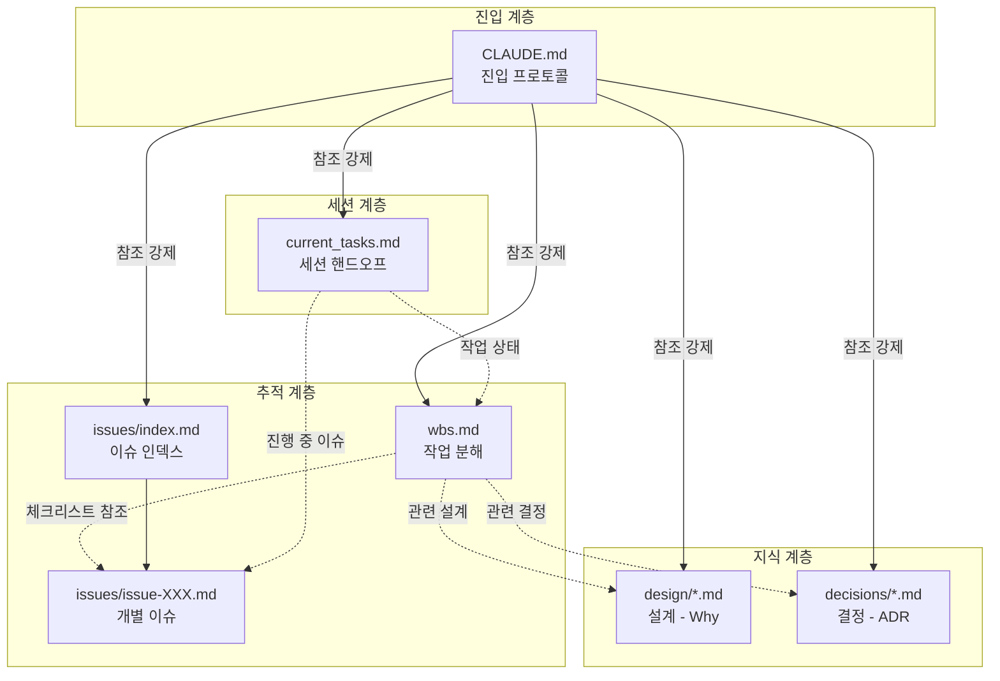
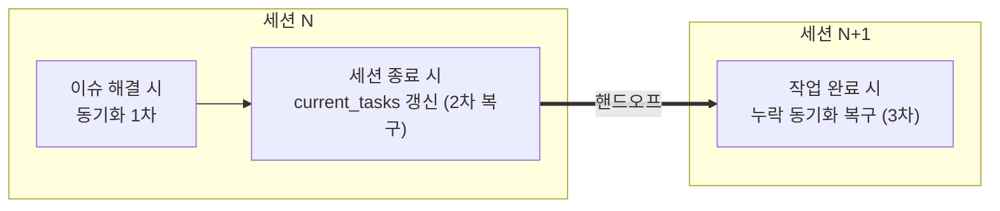

> 📚 시리즈 **「AI 코딩 실전」 1편**입니다. 이 시리즈는 [LLM의 발전 과정과 에이전트](/blog/llm-agents)에서 본 *이론*을, **실제로 코딩 도구를 다루는 현장**에 적용해 봅니다.

LLM 코딩 에이전트(Claude Code, Cursor, Antigravity 등)로 하루치 작업을 하는 건 쉽습니다. 문제는 **며칠, 몇 주에 걸쳐 한 프로젝트를 같이 끌고 갈 때** 생깁니다. 분명 어제 정한 건데 오늘 세션은 모르고, 길어진 대화는 초반 약속을 잊고 엉뚱한 길로 샙니다.

이 글은 "문서를 이렇게 쓰세요"라는 처방전이 아니라, **그 고통들을 하나씩 짚고 → 각각을 무엇으로 푸는지** 따라가는 글입니다.

---

## 1. 증상부터 — 코딩 에이전트와 장기 협업의 고통

오래 같이 일해 본 사람은 다 겪는 패턴입니다.

- **세션이 바뀌면 다 까먹는다.** 새 창을 열면 "지금 어디까지 했지?"부터 다시 설명해야 한다.
- **대화가 길어지면 드리프트한다.** 초반에 정한 제약·원칙을 잊고, 컨텍스트가 오염돼 점점 산으로 간다.
- **기각한 방향을 또 제안한다.** "그건 A 때문에 안 하기로 했잖아"를 매번 다시 말해야 한다.
- **내 말 한마디에 휘둘린다(sycophancy).** 무심코 던진 의견에 모델이 원칙을 굽혀 버린다.
- **같은 문제를 또 논의한다.** 2주 전에 분석한 버그를 처음 보듯 다시 판다.

이게 다 어디서 올까요?

> **근본 원인 하나입니다 — 프로젝트의 기억이 "대화"에 들어 있기 때문.** 대화는 휘발되고(세션 종료), 압축되고(컨텍스트 한계), 오염됩니다(길어질수록). 휘발성 매체에 장기 기억을 맡긴 게 문제입니다.

그런데 이 진단, 어디서 본 적 있죠? 이 블로그의 [LLM 시리즈](/blog/llm-agents-series/02-why-llm-gets-heavy)가 말한 바로 그 문제입니다 — **컨텍스트(대화)에 다 우겨넣지 말고, 중요한 건 외부 저장소로 빼라.** 2.5세대가 멀티턴의 컨텍스트 폭증을 *장기 기억*(외부 저장 + 선택적 검색)으로 푼 것과 똑같습니다.

**그 교훈을 코딩 협업에 그대로 적용하면 결론은 하나입니다 — 프로젝트 지식을 대화가 아니라 문서에 둔다.** 아래는 그 "문서"를 어떤 고통에 어떻게 대응시키는지의 이야기입니다.

---

## 2. 고통 → 처방

> **오해 방지 — 이 문서들을 사람이 직접 손으로 쓰는 게 아닙니다.** 아래 예시를 보고 "이걸 다 내가 작성해야 하나" 싶을 수 있지만, 사람의 역할은 *타이핑*이 아니라 **LLM에게 만들도록 지시하는 것**입니다. 채팅으로 문제를 함께 논의한 뒤 — *"지금까지 정한 결정을 ADR로 정리해줘"*, *"이번 세션 상태를 `current_tasks.md`로 갱신해줘"* 처럼 — **논의한 결과를 정리·문서화해 달라고 요청**하면 됩니다. 사람은 *무엇을 남길지 정하고 검토*하고, 실제 작성·갱신은 모델이 합니다. (이 블로그의 글들도 그렇게 씁니다.)

### 고통 ①: "지금 어디까지 했지?" → `current_tasks.md` (세션 핸드오프)

가장 자주, 가장 아픈 고통입니다. 세션이 바뀔 때마다 현재 상태를 다시 구축하는 비용.

**처방:** 현재 작업 컨텍스트를 **세션 밖 파일 하나**에 적어 둔다. 그러면 세션 리셋 비용이 거의 0이 되고, **드리프트가 느껴질 때 망설임 없이 새 세션으로 갈아탈 수 있습니다.** (긴 세션의 오염을 못 견뎌 끌고 가는 이유가 바로 "리셋이 비싸서"인데, 그 비용을 없애는 겁니다.)

```markdown
# 현재 작업 컨텍스트

## 작업 중인 항목
- WBS: #1.1.2 토큰 갱신 로직
- 관련 이슈: ISSUE-042

## 현재 상태
- 완료: 기본 갱신 플로우 구현
- 진행 중: 동시 요청 시 race condition 처리
- 막힌 부분: 분산 환경에서의 토큰 동기화

## 다음에 할 일
1. Redis 기반 토큰 락 구현
2. 통합 테스트 작성

## 주의사항
- 기존 쿠키 구조 변경하지 말 것 (하위 호환성)
```

> 딱 하나만 도입한다면 이것입니다. 효과 대비 비용이 가장 좋습니다.

### 고통 ②: 모델이 대화에 휘둘려 원칙을 굽힌다 → `CLAUDE.md` (행동을 강제하는 프로토콜)

`CLAUDE.md`를 "이 프로젝트는 X입니다"라는 **설명서**로 쓰면 효과가 약합니다. 핵심은 이걸 **프로토콜**, 즉 모델의 행동을 강제하는 규칙으로 쓰는 것입니다.

- ❌ 레퍼런스: "이 프로젝트는 OAuth를 씁니다."
- ✅ 프로토콜: "작업 시작 전 반드시 `wbs.md`의 해당 항목과 연결된 이슈·결정을 확인하라."

이렇게 두면 모델이 매 세션 **대화가 아니라 문서를 주 참조점으로** 삼게 되어, sycophancy(눈치보기)로 인한 원칙 훼손을 막습니다. 포함할 내용: 작업 전 읽을 문서 목록·순서, 작업 중 원칙, 완료 시 동기화 절차, 코드 규약.

### 고통 ③: "왜 이렇게 짰지?"를 잊는다 → `design/*.md` (Why를 저장)

구현 코드는 *무엇을* 했는지만 말하지 *왜* 그렇게 했는지는 안 남습니다. 시간이 지나면 본인도, 모델도 의도를 모른 채 건드리다 사고가 납니다.

**처방:** 설계 의도(Why)를 별도 문서에. 효과는 둘입니다 — ① 사람이 "왜 이렇게 설계했지?"를 재구성할 수 있고, ② 드리프트 상황에서 모델이 *사용자의 최근 한마디*가 아니라 **문서에 기록된 설계 원칙**을 우선하게 됩니다.

### 고통 ④: 기각한 대안을 또 제안한다 → `decisions/*.md` (ADR, "안 하기로 한 것")

컨텍스트가 압축될 때 <strong>가장 먼저 사라지는 정보가 "기각된 접근법"</strong>입니다. 그래서 새 세션은 이미 폐기한 방향을 천연덕스럽게 다시 제안합니다.

**처방:** 결정을 ADR(Architecture Decision Record)로 남긴다. 무엇을 **안 하기로** 했고 왜인지를 적어두면, 모델이 결정을 번복하기 전에 원래 이유를 보게 되어 **가벼운 번복도 막힙니다.**

```markdown
# [005] 인증 전략

## 상태
Accepted

## 고려한 대안
- 대안 A: 세션 쿠키 — 단순하나 분산 환경에 약함
- 대안 B: JWT + refresh rotation — 채택
- 대안 C: 서드파티 IdP 위임 — 외부 의존 과함

## 결정
B (refresh token rotation)

## 이유
분산 환경 무상태성 + 탈취 시 피해 최소화

## 결과
토큰 동기화 복잡도↑ (ISSUE-042에서 다룸)
```

### 고통 ⑤: 작업과 문제가 따로 논다 → `wbs.md` + `issues/`

작업 목록(WBS)과 이슈가 분리돼 있으면, 태스크를 끝내면서 관련 이슈를 잊고, 이슈는 "어느 작업과 엮였는지"를 잃습니다.

**처방:** WBS 체크리스트 항목에 **관련 이슈·결정·설계를 직접 링크**한다. 그러면 작업을 따라가는 동안 이슈가 자동으로 인식되고(망각 방지), 이슈에서 작업으로 역추적도 됩니다(쌍방향).

```markdown
## 1. 인증 시스템
- [ ] 1.1 OAuth 2.0 클라이언트 구현
  - 관련 이슈: [ISSUE-042](issues/issue-042.md)
  - 관련 결정: [decisions/005-auth-strategy.md](decisions/005-auth-strategy.md)
  - [ ] 1.1.1 인가 코드 플로우
  - [ ] 1.1.2 토큰 갱신 로직
- [x] 1.2 세션 관리
```

### 고통 ⑥: 같은 문제를 또 판다 → `issues/index.md` (이슈 인덱스)

**처방:** 이슈 인덱스를 관문으로 둔다. 인덱스만 먼저 로드해 **토큰을 아끼고**, 필요한 이슈만 골라 상세를 본다. "이거 전에 본 적 있나?"를 검색 한 번으로 끝냅니다.

```markdown
# 이슈 인덱스
## Open
- [ISSUE-042](issue-042.md) - OAuth 토큰 갱신 실패 (High)
## Resolved
- [ISSUE-038](issue-038.md) - 비밀번호 재설정 이메일 미발송
```

---

## 3. 전체 그림

위 처방들을 한 장으로 묶으면 이렇게 됩니다. `CLAUDE.md`가 진입점에서 다른 문서를 *참조하도록 강제*하고, 작업(WBS)·문제(이슈)·지식(설계·결정)·세션(현재 작업)이 서로 링크됩니다.



작업 항목 하나는 네 갈래의 문서로 뻗습니다 — **왜(설계)·어떻게 정했나(결정)·무엇이 문제인가(이슈)·지금 어디까지(현재 작업).**

---

## 4. 그럼 문서끼리 안 맞으면? → 최종적 일관성 + 3중 복구

여기서 흔한 반론이 나옵니다. *"문서를 그렇게 많이 두면 동기화가 안 맞아서 더 헷갈리지 않나?"*

맞습니다. 그래서 **완벽한 동기화를 목표로 하지 않습니다.** 분산 시스템의 **최종적 일관성**(eventual consistency)처럼, 순간적 불일치는 허용하되 **자연스러운 체크포인트에서 자동 복구**되게 설계합니다.



동기화 누락이 *연속으로* 쌓이려면 세 체크포인트를 내리 놓쳐야 하는데, 확률적으로 드뭅니다. (단, 긴급 작업이 며칠 연속이면 `current_tasks.md`만 갱신되고 나머지가 방치될 수 있으니, 마일스톤마다 전체 일관성 점검을 체크리스트로 두면 됩니다.)

---

## 5. 왜 이게 "사람 협업"과도 똑같은가

눈치챘겠지만, 이 문서들은 **LLM을 위해 새로 발명한 게 아닙니다.** 수십 년 검증된 엔지니어링 관행 그대로입니다.

| 기존 관행 | 이 시스템 |
|---|---|
| ADR (Architecture Decision Records) | `decisions/*.md` |
| Design Docs | `design/*.md` |
| WBS (Work Breakdown Structure) | `wbs.md` |
| Issue Tracker | `issues/` |
| Working Memory / Handoff Notes | `current_tasks.md` |

그래서 **LLM용 문서화가 사람용 문서화와 완전히 일치합니다 — 이중 투자가 없습니다.** 게다가:

- **벤더 중립**: 모델·IDE가 바뀌어도 문서 자산은 그대로 유효하다(= [model-agnostic](/blog/llm-agents-series/06-agent-company-moat), 모델은 빌려 쓰는 것).
- **메타인지 도구**: 이 문서들은 모델만이 아니라 **작성자 본인의 기억 확장**이기도 하다. 사람과 모델이 같은 기억을 공유한다.

---

## 6. 어디서부터 — 한 번에 다 만들지 말 것

전부 갖추려다 지치면 본말전도입니다. 필요가 생기는 순서로 점진 도입하세요.

1. **먼저**: `CLAUDE.md` + `current_tasks.md` (효과 대비 비용 최고)
2. **다음**: `wbs.md`, `issues/index.md`
3. **커지면**: `design/`, `decisions/`

소형·단기 프로젝트라면 1번만으로도 충분합니다. 문서는 정적으로 두지 말고 프로젝트와 함께 진화시키고, **CLAUDE.md의 규칙이 실제로 지켜지는지 주기적으로 검토**해 안 지켜지는 규칙은 고치거나 버리세요(지켜지지 않는 규칙은 노이즈일 뿐입니다).

> **실전 팁 — 가장 쉬운 시작법.** 구조를 외워 손으로 세팅할 필요 없습니다. **이 글 전체를 모델에게 읽히고 "*현재 프로젝트에 이 문서 시스템을 적용해줘*"라고 요청하세요.** 알아서 하도록 지시만 내리면, 모델이 `CLAUDE.md`·`current_tasks.md`부터 프로젝트 구조에 맞춰 초안을 잡아 줍니다 — 당신은 그 결과를 검토하고 다듬기만 하면 됩니다.

---

> 정리하면 — 코딩 에이전트와의 장기 협업이 무너지는 건 모델이 멍청해서가 아니라 **기억을 휘발성 대화에 맡겼기 때문**입니다. 기억을 문서로 외부화하고, 그 문서가 서로를 참조하게 하고, 동기화는 체크포인트에서 복구되게 두면 — 세션이 바뀌어도, 모델이 바뀌어도 프로젝트는 이어집니다. 이건 [에이전트가 컨텍스트·기억을 다루는 방식](/blog/llm-agents)을, 사람이 손으로 구현한 버전입니다.

---

#### 📚 시리즈 내비게이션

- **연결 이론:** [LLM의 발전 과정과 에이전트](/blog/llm-agents) (이 시리즈의 개념적 뿌리)
- **1편 (지금):** 코딩 에이전트와 장기 협업하는 문서화 시스템 ← 현재 글
- **다음 편:** [2편 · 토큰·컨텍스트를 가볍게 유지하는 법](/blog/ai-coding-series/02-tokens-context-keep-light)
