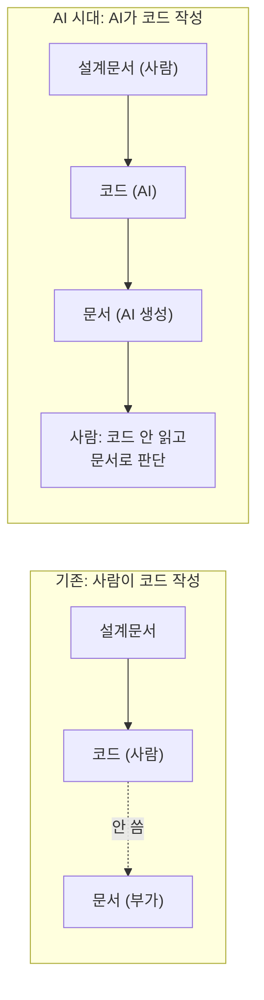

> 📚 시리즈 **「AI 코딩 실전」 4편**입니다. 앞 편은 [3편 · 분할정복](/blog/ai-coding-series/03-divide-and-conquer).

AI가 코드를 분당 수백 줄 쏟아냅니다. 그런데 — **그걸 다 읽고 검토할 수 있나요?** 못 합니다. 그럼 품질은 어떻게 판단할까요? 여기서 소프트웨어 개발의 무게중심이 **코드에서 문서로** 넘어갑니다.

---

## 1. 문제 — 코드만 있으면 무너진다

문서 없이 코드만 있으면 이런 일이 생깁니다.

- **"왜 이렇게 만들었는지" 추적 불가** → 바꿀 때마다 전체 재분석.
- **변경 영향 범위를 모른다** → "이거 고치면 뭐가 깨지지?"
- **AI에게 변경을 못 시킨다** → 요구사항이 코드에 *암묵적으로 묻혀* 있어 전달이 안 된다.

게다가 코드는 **한 번 쓰이고 최소 3~10번 읽힙니다**(버그 수정·기능 추가·리뷰·온보딩·장애 대응). 그래서 *빨리 막 쓰면* 읽기 비용이 폭발합니다.

| 방식 | 작성 비용 | 읽기 비용(×5회) | 총 비용 |
|---|---|---|---|
| 빠르게, 품질 낮게 | 1 | 2×5 = 10 | **11** |
| 2배 들여 품질 높게 | 2 | 1×5 = 5 | **7** |
| 2배 + 설계문서 | 2.5 | 0.5×5 = 2.5 | **5** |

> 작성에 2배가 걸려도 읽기가 절반이면 총비용이 준다. **리팩토링·문서화가 이익인 이유** — 읽기 비용을 N번 절감하니까.

---

## 2. 핵심 통찰 — 상류가 정확하면 하류는 기계적이다

소프트웨어는 파이프라인입니다: **요구사항 → 아키텍처/유스케이스 → 모델 → 코드.** 상류(요구사항·설계)가 정확하면 **하류(코드)는 거의 기계적으로 도출·검증**됩니다.

| 상류 산출물 | 하류에서 자동 도출 |
|---|---|
| 유스케이스 중단점 | 트랜잭션 범위·API 엔드포인트 |
| 콜레보레이션 데이터(payload) | 도메인 모델 필드·Request DTO |
| 상태 전이 | 모델 메서드 |
| 인터페이스 정의 | WBS 작업 항목 |
| 모델 + 인터페이스 | **구현 코드 (LLM 생성 가능)** |

즉 **코드는 파이프라인의 최하류 소모품이고, 설계문서는 자산**입니다.[^naur] 실제로 아키텍처를 갈아엎어도(V1→V2) "사용자가 무엇을 하려는가"(유스케이스)는 그대로 재사용됩니다.

---

## 3. AI 시대의 역전 — 코드 → 문서

기존엔 사람이 코드를 쓰고 문서는 *귀찮아서 안 쓰는* 부가물이었습니다. AI가 코드를 쓰면 이 관계가 뒤집힙니다.

**AI가 코드를 쓰면, 사람이 코드를 읽을 필요가 없습니다.** AI가 코드와 함께 문서를 생성하고, 사람은 **설계문서 ↔ 결과문서를 비교**해 판단합니다. 한 줄도 안 읽고 "설계 의도대로 됐는가"를 검증할 수 있죠 — 단, 그러려면 **상류 설계문서의 품질이 곧 프로젝트의 품질**이 됩니다.

---

## 4. 산출물로 판단한다 — 의료 차트의 비유

의사는 환자 몸을 열지 않아도 **차트·검사결과·영상**으로 진단·처방합니다. 산출물이 정확하기 때문이죠. SW도 같습니다 — 관리자는 코드를 안 읽어도 **산출물로 프로젝트를 진단**합니다.

| 의료 | SW 산출물 | 판단할 수 있는 것 |
|---|---|---|
| 환자 차트 | 설계문서(유스케이스·아키텍처) | 무엇을 왜 하는가 |
| 혈액검사 | 테스트 결과·커버리지 | 정상 동작하는가 |
| X-ray/MRI | 벤치마크 보고서 | 성능·품질 충족하는가 |
| 처방전 | WBS·작업 지시 | 다음에 뭘 할까 |

> "테스트 62건 통과·커버리지 90%" → 코드 안 봐도 "품질 양호". "벤치마크 10.4분/10p" → "성능 미달, 아키텍처 변경." **코드는 환자의 몸, 산출물은 차트.** 관리자는 몸을 열지 않고 차트로 관리합니다.

> ⚠️ **단, '차트'가 정확할 때만입니다 — 현재의 한계.** "테스트 통과 = 품질 양호"는 *테스트 자체가 제대로 짜였을 때만* 성립합니다. 그런데 **AI는 테스트 코드를 대충·잘못 쓰는 일이 많습니다** — 늘 통과하는 빈 테스트, 엉뚱한 걸 검증하는 테스트, happy path만 보는 테스트. 그래서 **유닛·통합 테스트 코드는 적어도 한 번은 사람이 직접 확인**해야 합니다. 더 넓게는 — *적어도 아직은* — **각 단계의 산출물이 품질 기준을 만족하는지 사람이 검사할 수 있어야** 합니다. "코드를 안 읽고 문서로만 판단한다"는 건 *지향점*이지, AI를 100% 믿어도 되는 단계는 아직 아닙니다. 그 *'검증을 검증하는'* 한 번은 여전히 사람의 몫입니다.

---

## 5. 그래서 사람의 역할 — 작성이 아니라 판단

이 구조에서 사람의 핵심 역할은 **코드 작성이 아니라 설계문서 작성과 판단**입니다.

1. 사람이 유스케이스·품질 속성을 정의 → 2. AI가 코드 생성 → 3. AI가 코드에서 문서 생성 → 4. 사람이 **설계문서 ↔ 결과문서**를 비교해 판단.

여기서 가장 중요한 역설이 나옵니다.

> **AI를 잘 쓰려면 AI 없이도 할 수 있어야 한다.** 직접 코드를 안 짜더라도, *어떤 코드가 나와야 하는지 판단할 수준의 지식*이 필요하다. AI는 능력을 대체하는 게 아니라 **증폭**한다 — 기반이 0이면 아무리 증폭해도 0이다.

이건 이론 시리즈 [4편 · 작은 모델 + 루프](/blog/llm-agents-series/04-small-model-big-loop)의 "추론의 하한값"과 정확히 같은 이야기입니다. AI가 속도를 내고, 사람이 방향을 잡습니다 — **속도 없는 방향은 느리고, 방향 없는 속도는 위험합니다.**

---

> 정리: AI 코딩의 무게중심은 코드에서 **상류 문서**로 옮겨갔습니다. 코드는 AI가 빠르게 쏟아내는 소모품이고, 사람이 쥘 것은 *정확한 설계*와 *산출물로 판단하는 눈*입니다. **그럼 그 설계를 어떻게 만들고, 코드 쓰기 전에 어떻게 검증하느냐** — 다음 편 주제입니다.

---

## 미주 (참고 자료 및 링크)

[^naur]: **[1차 문헌]** Peter Naur, 「Programming as Theory Building」, *Microprocessing and Microprogramming* 15(5), 1985, pp. 253–261 (저서 *Computing: A Human Activity*, 1992에 재수록). — 프로그래밍의 본질은 코드(텍스트)가 아니라 문제에 대한 *이론*을 세우는 일이며, 코드는 그 이론의 파생물이라는 논지. '코드는 소모품, 설계(이론)는 자산'의 이론적 뿌리. <https://pages.cs.wisc.edu/~remzi/Naur.pdf>

---

#### 📚 시리즈 내비게이션

- **연결 이론:** [작은 모델 + 루프가 큰 모델을 이긴다](/blog/llm-agents-series/04-small-model-big-loop)
- **이전 편:** [3편 · 분할정복](/blog/ai-coding-series/03-divide-and-conquer)
- **4편 (지금):** 코드보다 문서다 — AI 시대의 역전 ← 현재 글
- **다음 편:** [5편 · 코드 쓰기 전에 설계를 검증하라](/blog/ai-coding-series/05-verify-design-before-code)
