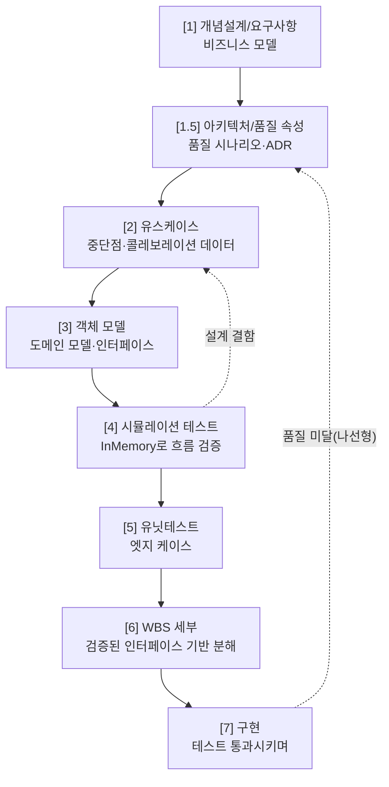

> 📚 시리즈 **「AI 코딩 실전」 5편**입니다. 앞 편([4편 · 코드보다 문서다](/blog/ai-coding-series/04-docs-over-code))에서 *상류 설계가 곧 품질*이라고 했습니다. 그럼 그 설계를 **어떻게 만들고, 코드 쓰기 전에 어떻게 검증**할까요?

AI에게 "번역 시스템 만들어줘" 하고 바로 코딩에 들어가면, 십중팔구 다시 짓습니다. **설계를 먼저 검증하고 코드는 마지막에** 짜는 절차가 필요합니다.

---

## 1. 문제 — 바로 코딩하면 두 번 짓는다

- **요구사항이 안 굳은 채 시작**하면, 발주자 마음이 바뀔 때마다 시스템 전체를 뜯어고친다.
- **품질 속성(성능·확장성·복구성)은 구현하고 운영해 봐야 드러난다.** 기능은 되는데 *느리고 확장이 안 되는* 걸 나중에 발견하면, 아키텍처를 통째로 갈아엎어야 한다.

> 기능(What)이 같은데 아키텍처(How)가 바뀌는 원인은 **거의 항상 비기능 요구사항(품질 속성)**입니다.

---

## 2. 해결 — 산출물이 다음 단계를 정당화하는 연쇄

각 단계의 산출물이 다음 단계의 입력이자 정당성이 됩니다. **코드는 맨 마지막.**



핵심 세 가지만 짚습니다.

### ① 코드 전에 '시뮬레이션'으로 검증한다

인터페이스의 가장 단순한 구현체(InMemory)만 만들어, **유스케이스 흐름을 테스트로 재현**합니다(LLM·DB는 mock). 목적은 정확성이 아니라 **상태 전이·데이터 흐름의 정합성**입니다.

> 여기서 "모델에 `chapter_id`가 없네", "complete 후 상태가 안 맞네" 같은 결함이 잡힙니다. **이때 수정 비용은 0에 가깝습니다**(필드 추가). 구현 후라면 DB 마이그레이션·API 변경·테스트 재작성이 필요하죠.

### ② 탑다운 — 클라이언트 호출을 먼저 쓴다

바텀업으로 모듈부터 만들면 파라미터가 안 맞아 수정을 반복합니다. **호출하는 쪽이 원하는 형태를 먼저 결정**하면 인터페이스가 자연스럽게 도출됩니다.

```python
# 1) 클라이언트가 원하는 호출부터
result = await chat.chatWithFiles("이 영수증 분석해줘", [file])
# 2) 여기서 파라미터/결과 객체가 도출 → 3) 인터페이스 → 4) 구현은 마지막
```

> 파라미터가 3개 넘으면 객체로 캡슐화 — 나중에 필드를 더해도 시그니처가 안 바뀝니다.

### ③ 나선형 — V1(기능) → V2(품질 속성)

품질 속성은 첫 바퀴에 다 알 수 없습니다. **V1으로 기능을 검증(PoC)하고, 운영·벤치마크로 품질 미달을 발견한 뒤, V2에서 아키텍처를 재설계**합니다. 이때 **유스케이스·도메인 모델은 재사용**됩니다(기능은 그대로니까).

---

## 유스케이스의 진짜 힘 — '보이지 않는 가정'을 드러낸다

유스케이스가 단순 문서 작업이 아닌 이유가 여기 있습니다. 유스케이스는 **시스템의 빈 곳 — 보이지 않는 가정 — 을 찾아내는 데 탁월**합니다.

어떤 작업이든 *그게 가능한 컨텍스트(선행 조건)*가 먼저 갖춰져야 합니다. "상품을 주문한다"는 한 줄 같지만, 유스케이스로 선행 조건을 따지면 — **상품이 등록돼 있고, 회원에게 권한이 있고, 결제수단·배송지·재고가 준비돼** 있어야 합니다. 이 각각이 *또 하나의 작업(서브시스템)*이죠.

> 그래서 유스케이스 분석은 **진짜 범위(scope)를 드러냅니다.** 해피 패스만 보면 "주문 기능 하나"지만, 선행 조건을 식별하면 작업량이 몇 배로 벌어진다는 걸 *구현 전에* 알게 됩니다 — 보이지 않는 가정을 늦게 발견할수록 비용이 폭발하니까요(빙산의 물밑).

그리고 바로 이 *보이지 않는 가정 찾기*가 AI의 약점입니다([6편](/blog/ai-coding-series/06-workflow-as-agent-prompts)). AI는 *지시한 건 잘, 안 지시한(=숨은 가정)은 빠뜨립니다.* 특히 전례 없는 새 영역에선 그 가정을 *익숙한 패턴으로 덮어* 범위를 과소평가하죠. 그래서 선행 조건·경계를 캐내는 유스케이스 판단은 사람이 끝까지 쥐어야 합니다.

**그리고 두 번째 힘 — 잘 쓴 유스케이스는 그대로 '테스트 시나리오'가 됩니다.** 기본 흐름·예외 흐름·선행/사후 조건이 곧 검증 항목이라, AI는 이걸 받아 **유닛 테스트·통합 테스트를 자동 생성**할 수 있습니다(앞의 4단계 시뮬레이션 테스트가 정확히 이것 — 유스케이스 흐름을 코드로 재현). 즉 *사람이 판단으로 만든 유스케이스가, 하류의 검증을 자동화 가능하게* 만듭니다 — **인간 상류 → 자동 하류**의 다리죠. 검증 가능한 시나리오만 있으면 AI는 강하니까요([6편의 자동화 경계](/blog/ai-coding-series/06-workflow-as-agent-prompts)).

**세 번째 힘 — 구현을 검증하는 '기준 문서'가 됩니다.** 구현이 설계대로 안 됐을 때, 유스케이스가 *정답지* 역할을 합니다 — "설계엔 fallback 승인인데 코드엔 없다"처럼 **결과를 문서와 대조해** 어긋남을 잡죠([산출물로 판단](/blog/ai-coding-series/04-docs-over-code)). 게다가 *어떤 결정을 했고 무엇이 바뀌었는지(결정·변경 이력)*까지 남아, 나중에 "왜 이렇게 했지?"에 답이 됩니다([결정 기록](/blog/ai-coding-series/01-doc-system-for-llm-collaboration)).

**네 번째 — 작업 관리로 이어집니다.** 식별된 선행 조건·중단점이 그대로 **WBS(작업 분해)** 항목이 되고, 작업 중 발견한 문제는 **이슈 트래킹**으로 해당 유스케이스 단계에 연결됩니다([1편의 WBS·이슈](/blog/ai-coding-series/01-doc-system-for-llm-collaboration)).

> 정리하면 — **유스케이스 하나가 하류 전체를 구동합니다.** ① 보이지 않는 가정 → **진짜 범위**, ② 테스트 시나리오 → **검증 자동화**, ③ 기준 문서 → **구현 검증·결정 이력**, ④ WBS·이슈 → **작업 분해·문제 추적**. 상류에 쏟은 사람의 판단이, 하류 전체로 되돌아옵니다.

**한마디로 — '말로 시키던 일'을 '유스케이스(문서)로 시키는 것'입니다.** 채팅의 즉흥(vibe)을 *구조화된 작업 지시*로 바꾸는 거죠([개요](/blog/ai-coding-series/00-overview)의 "말 대신 구조"). 그리고 모든 하류가 유스케이스로 거슬러 **추적**되므로, 중간에 틀린 걸 발견하면 ***어느 단계*에서 어긋났는지** 짚어낼 수 있습니다 — *코드가 틀렸나, 테스트가 틀렸나, 아니면 유스케이스 자체가 틀렸나.* 말로 시킬 땐 불가능했던, **디버깅 가능한 작업 지시**가 되는 겁니다.

**그리고 바꿀 때도 똑같습니다.** 로직이나 구현을 바꾸고 싶으면 *코드를 직접 고치지 않습니다* — **유스케이스(상류 문서)를 고치고, 하류(모델·테스트·코드)를 다시 흐르게** 합니다. 코드는 문서에서 *컴파일된 결과물*이고, 진짜 '소스'는 문서니까요([코드는 소모품, 문서는 자산](/blog/ai-coding-series/04-docs-over-code)). 어느 단계의 문서를 고치면 그 영향이 어디까지 번지는지도 추적되니, **변경의 영향 범위까지 구현 전에 보입니다.**

---

## 3. 실제 사례 — DTAF (2~3주 → 1~2일)

300페이지 PDF를 번역하는 시스템 DTAF는 V1(LangGraph 단일 루프)로 기능을 검증했습니다. 기능은 됐지만 벤치마크에서 품질 속성이 무너졌죠.

- 모델 스위칭이 **전체 시간의 18%** 낭비 (매 청크 교체)
- 서버 이원화해도 **9% 개선뿐** → LangGraph 구조가 병렬화를 가로막음
- → **큐 + Worker 병렬 아키텍처(V2)**로 전환, GPU당 Worker 추가로 선형 확장

여기서 핵심은 **속도**입니다. LLM으로 설계문서·시뮬레이션·유닛테스트(62건)까지 **1~2일**에 갖췄습니다(기존이라면 2~3주). LLM은 코드 생성기가 아니라 **의사결정 가속기** — 빨리 산출물을 만들고, 산출물로 판단하고, 틀리면 빨리 다시 돕니다.

---

## 4. 추적성 — 어느 단계든 "왜?"가 한 단계 위를 가리킨다


"왜 `chapter_id`가 있나?" → 유스케이스 IP-3. "왜 큐 기반인가?" → 확장성 품질 속성. 이 추적이 끊기면, 코드가 잘 돌아도 **왜 존재하는지 아무도 모르는 레거시**가 됩니다.

---

> 정리: AI가 코드를 빠르게 쓰는 시대일수록, 사람은 **검증된 설계 파이프라인**을 운영해야 합니다. 코드 쓰기 전에 시뮬레이션으로 설계를 검증하고(비용 0에 결함 발견), 탑다운으로 인터페이스를 도출하고, 나선형으로 품질 속성에 대응한다 — 이게 [4편의 "상류 문서가 곧 품질"](/blog/ai-coding-series/04-docs-over-code)을 *실제로 굴리는* 방법입니다.

---

#### 📚 시리즈 내비게이션

- **연결 이론:** [LLM의 발전 과정과 에이전트](/blog/llm-agents)
- **이전 편:** [4편 · 코드보다 문서다](/blog/ai-coding-series/04-docs-over-code)
- **5편 (지금):** 코드 쓰기 전에 설계를 검증하라 ← 현재 글
- **다음 편:** [6편 · 워크플로우를 에이전트에게](/blog/ai-coding-series/06-workflow-as-agent-prompts)
