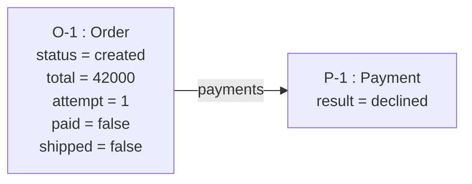
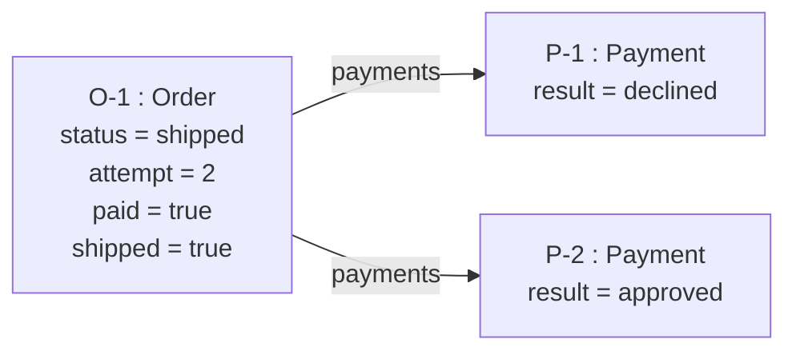

> 📚 시리즈 **「AI 시대의 실전 엔지니어링」 2편**입니다([개요](/blog/ai-era-engineering/00-overview)). [1편](/blog/ai-era-engineering/01-usecases-not-feature-lists)에서 유스케이스를 썼습니다. 그런데 — **그게 맞는지 어떻게 압니까?** 뒤에서 [디버깅(3편)](/blog/ai-era-engineering/03-debugging-methodology)·[유닛테스트(4편)](/blog/ai-era-engineering/04-unit-testing)가 태어난 *코드*를 검증한다면, 이 글은 **코드가 존재하기도 전에 *설계*를 검증**합니다. 명세를 세운 바로 다음, 가장 이른 검증 — 연역으로 설계를 무너뜨려보는 일입니다.

유스케이스와 도메인 모델을 다 그렸습니다. 이게 맞는지 확인하는 가장 흔한 방법은 — **일단 만들어서 돌려보는 것**입니다. UI 붙이고 DB 붙이고 API 붙여서, 실제로 주문을 넣어 보는 거죠. 그런데 그건 *수천 줄을 짠 뒤에야* "이 설계 틀렸네"를 알게 되는 방법입니다. 비쌉니다.

더 나은 방법이 있습니다. **구체적인 값 하나를 유스케이스 전 단계에 흘려보내, 각 단계에서 도메인 모델이 그 값을 담고 올바르게 전이하는지 확인하는 것.** UI·DB·네트워크 없이, 설계 시점에, 인메모리로. 이것이 우리가 [첫 시리즈 격](/blog/ai-era-engineering/00-overview)에서 말한 **연역적 검증** — 세운 모델(가설)에 실제 값을 넣어 *무너지는 지점을 찾는* 실험입니다.

## 1. 핵심 — 유스케이스와 모델은 같은 것의 두 축이다

유스케이스와 도메인 모델은 따로 노는 두 문서가 아닙니다. 하나의 시스템을 **두 축**에서 본 것입니다.

- **유스케이스 = 행위 축** — 단계별로 *무엇이 일어나는가* (주문 생성 → 결제 → 배송 → 종료)
- **도메인 모델 = 구조 축** — *어떤 객체·필드·링크가 있는가* (`Order.status`, `Order.paid`, `Payment[]`)

검증이란 **이 두 축에 구체적인 값 하나를 흘려, 매 단계에서 서로 어긋나지 않는지 보는 것**입니다. 유스케이스가 "결제 재시도"라는 단계를 요구하는데 모델에 `paymentAttempt` 필드가 없다면? 어긋납니다. 그 어긋나는 지점이 **곧 결함**입니다.

더 구체적으로 보면, 유스케이스의 각 단계는 목적을 향해 나아가며 **이전 단계가 만든 데이터로 다음 단계의 작업을 수행**합니다 — 주문 생성이 만든 주문으로 결제를 하고, 결제가 남긴 `paid` 상태로 배송을 하죠. 그러니 검증이란 **매 단계에서 "다음 작업에 필요한 데이터가 여기까지 다 갖춰졌는가"를 확인하는 일**입니다. 어느 단계가 요구하는 값이 앞 단계에서 만들어지거나 실려 오지 않았다면 — *데이터가 모자라거나 빠졌다면* — 바로 거기가 결함입니다. 단계마다 스냅샷을 찍는 이유가 이것입니다: 데이터가 단계를 건너며 *충분히 채워져 흐르는지*를 눈으로 좇는 것.

## 2. 두 가지 투영 — 다르게 보이지만 같은 작업

같은 검증을 두 방식으로 할 수 있고, 둘은 **서로를 대체하지 않고 교차검증**합니다.

| 투영 | 무엇을 | 성격 |
|---|---|---|
| **화면 설계** | 각 중단점의 화면이 트랜잭션 Payload를 다 갖는가 | 정적 · 사람이 읽음 |
| **오브젝트 다이어그램** | 각 단계 전/후 **객체 값 스냅샷** + 전이 단언 | 동적 · 인스턴스 값 추적 (**더 강력**) |

둘 중 하나만 해도 검증이지만, 둘이 **같은 판정**을 내야 합니다. 화면이 요구하는 데이터가 Payload에 없거나, 스냅샷에 담을 필드가 없으면 — 전부 *같은 결함*을 다른 각도에서 가리킵니다. 아래에서는 더 강력한 **오브젝트 다이어그램(스냅샷)** 을 실전으로 보입니다.

## 3. 실전 — 오브젝트 다이어그램으로 무너뜨려보기

"주문한다" 유스케이스를 봅시다. 구조 축(도메인 모델)은 두 객체입니다 — **`Order`**{ 상태·총액·결제시도횟수·결제여부·배송여부 }, **`Payment`**{ 결과 }. 여기에 행위 축을 흘리되 **결제 1차 거절 → 재시도 승인** 예외 경로까지 넣고, 각 단계에서 **객체 값 스냅샷**을 찍습니다. 그 스냅샷 묶음이 곧 오브젝트 다이어그램 — 사람이 눈으로 읽는 검증 근거이자 단계별 상태 머신입니다.

예외가 걸리는 결정적 두 지점을 그림으로 보면 — 각 노드가 그 시점의 **객체 인스턴스와 필드 값**입니다.

> **[P2] 결제 1차 거절** — `attempt`가 1로 오르고 `declined` 결제가 기록되지만 `paid`는 아직 `false`:



> **[P2'→P3] 재시도 승인 후 배송** — 재시도로 `attempt=2`·`paid=true`가 되어(`P-1 declined` 이력은 남음) 그제야 배송으로 전이:



전 구간의 값 변화를 한 줄씩 요약하면 — 각 단계 전/후로 이렇게 찍힙니다:

```
[P1] 주문 생성    order{ created, attempt=0, paid=false, shipped=false }   payments: —
[P2] 결제 거절    order{ created, attempt=1, paid=false, shipped=false }   payments: P-1 declined   ← 예외
[P2'] 재시도 승인  order{ paid,    attempt=2, paid=true,  shipped=false }   payments: +P-2 approved
[P3] 배송         order{ shipped, attempt=2, paid=true,  shipped=true  }   payments: (동일)
[P4] 종료         order{ closed,  attempt=2, paid=true,  shipped=true  }   payments: (동일)
```

이 다이어그램에서 **각 전이를 눈으로 단언**합니다 — `status`가 `created → paid → shipped → closed`로만 가는가, `attempt`가 `0 → 1 → 2`로 오르는가, `paid`가 딱 한 번 `false → true`로 뒤집히는가. 그리고 §1에서 말한 **데이터 연쇄**를 확인합니다: `[P3] 배송`은 `paid=true`를 전제하는데, 스냅샷을 보면 `[P2']`에서 이미 채워져 넘어옵니다. 만약 `paid` 없이 배송으로 건너뛴다면 — 그 자리가 결함입니다.

전체 시스템을 안 만들고, **종이 위 스냅샷 몇 장으로 설계가 옳은지 판정**했습니다. 규율은 셋입니다:

- **구체 데이터 하나를 전 구간에 흘려라** — 추상 검토가 아니라 *인스턴스 1개*(정상 + 예외)를 처음부터 끝까지 통과시킨다.
- **각 단계 전/후를 찍어라** — 상태 전이(`created→paid→shipped→closed`)와 값 채움(`attempt 0→1→2`)을 단계마다 단언한다. 전/후 비교가 상태 머신을 드러낸다.
- **예외 경로를 반드시 넣어라** — 결제 거절 같은 반증 케이스가 상태 머신의 진짜 모습을 드러낸다([4편의 "깨뜨리기를 목표로"](/blog/ai-era-engineering/04-unit-testing)와 같은 정신).

## 4. 갭은 이렇게 드러난다 — 모델 결함 vs UC 결함

검증의 진짜 힘은 **유스케이스와 도메인 모델의 누락을 *동시에* 적출**한다는 데 있습니다.

- **모델 결함**: 만약 `Order`에 `paymentAttempt` 필드가 **없다면**, 재시도 스냅샷에 담을 칸이 없어 오브젝트 다이어그램이 `[P2]→[P2']` 재시도를 표현하지 못합니다 → **도메인 모델에 필드를 추가**하라.
- **UC 결함**: 만약 유스케이스가 "결제 거절 → 재시도" 단계를 **기술하지 않았다면**, 시나리오에 `P2'`가 없어 흐름이 끊깁니다 → **유스케이스에 대안 흐름을 추가**하라.
- **불변식 위반**: 미결제(`paid=false`) 상태에서 `[P3] 배송`으로 넘어가려 하면 규칙 위반입니다 → 트랜잭션 경계(미결제 배송 금지)를 스냅샷이 즉시 잡습니다.

> **막히면 곧 결함입니다.** 스냅샷에 *담을 값이 없으면 모델 결함*, *단계가 비면 UC 결함*. 고치고 다시 실행 — 모델과 유스케이스가 **함께 수렴**할 때까지 왕복합니다.

## 5. 전제를 역추적하라 — 시스템 경계에서 빠진 절차 찾기

오브젝트 다이어그램이 값의 *흐름*을 검증한다면, 완전성을 점검하는 짝이 하나 더 있습니다. 유스케이스가 **당연한 듯 깔고 들어가는 전제**를 만날 때마다 멈추십시오. 가장 흔한 신호가 "*X를 목록에서 선택한다*"입니다 — X는 하늘에서 떨어지지 않으니, 반드시 두 가지를 함의합니다.

> **① X를 존재하게 만든 단계나 절차** 가 어딘가 명세돼 있어야 한다 — *어떤 액터가 X를 확립하는 목적적 절차(어느 유스케이스의 한 단계이든, 별도 절차이든).* 시스템 코드·드롭다운 값이라도, 누군가 그 값 집합을 정하고 관리하는 절차가 있어야 합니다.
> **② X 목록을 가져오는 수단(조회 화면·API)** 이 있어야 한다.
> 둘 중 하나라도 스펙에 없으면 — **그게 빠진 명세**입니다.

**여기서 그 절차를 화면과 혼동하면 안 됩니다.** "카테고리 등록 화면"은 목적이 아니라 UI 표면입니다. X를 낳는 것은 "*관리자가 문서를 체계적으로 분류·검색할 수 있도록 분류 체계를 구성한다*"는 **목적적 절차**(유스케이스의 본질)이고, 등록 화면은 그 절차를 실어 나를 뿐이죠. 이 둘을 뭉개는 순간 유스케이스는 CRUD로 무너집니다([1편](/blog/ai-era-engineering/01-usecases-not-feature-lists)). 역추적이 찾는 것은 화면이 아니라 **그 X를 낳은 목적적 절차**입니다.

예컨대 "*주문 시 배송지를 목록에서 선택한다*"는 한 줄은, **고객이 배송지를 관리하는 절차**와, 그 배송지를 **가져오는 조회 수단**을 요구합니다. "*상태를 드롭다운에서 고른다*"는, 그 상태 코드 집합을 **누군가 정하고 관리하는 절차**가 어딘가 있다는 뜻이고요. 그 절차나 조회 수단이 스펙에 없다면, 방금 빠진 명세를 찾은 겁니다.

**이건 결국 시스템 경계를 그리는 일입니다.** '선택'만이 아니라, 유스케이스가 깔고 들어가는 모든 전제가 같은 신호예요. 예컨대 어떤 유스케이스가 "*로그인부터 시작한다*"면 — 그 한 줄 뒤에 **사용자 등록 → 권한 할당 → 인증 → 비밀번호 변경**처럼 로그인을 성립시키는 절차들이 통째로 숨어 있습니다. '당연히 있겠지' 하고 넘기기 쉽지만, 실은 *시스템이 구현해야 할 범위(경계) 안*에 있는 것들이죠. 전제를 역추적하면, **경계 안에 있는데 명세에서 빠진 절차**를 빠짐없이 끌어냅니다 — 개발 막판에 "어, 이 화면도 만들어야 하네"로 일정이 무너지기 전에.

이건 오브젝트 다이어그램과 정확히 짝을 이룹니다 — 선택 대상 X는 **선행조건 스냅샷에 인스턴스로 이미 존재**해야 하니까요. 그래서 판별은 이렇게 합니다:

1. 각 "X를 선택한다" 앞에서, **선행 스냅샷에 `X` 인스턴스를 그려보라.**
2. **못 그리겠으면** → X를 낳은 단계·절차가 없다(누락).
3. **그릴 순 있는데 가져올 길이 없으면** → 조회 수단(화면·API)이 없다(누락).

'선택'·'로그인' 같은 흔한 전제 한 조각이, 이렇게 시스템 경계 안에 빠진 절차를 줄줄이 끌어냅니다.

## 6. 되먹임 — 검증은 유스케이스에서 닫힌다 (SSOT)

여기서 대부분이 놓치는 마지막 한 걸음. **검증 자체가 목적이 아닙니다.** 검증으로 확정한 트랜잭션/콜레보레이션 데이터(Payload)·상태 전이를 **각 중단점의 유스케이스로 되먹여야** 합니다.

되먹이고 나면 유스케이스가 **자기완결 SSOT**(Single Source of Truth)가 됩니다 — 나중엔 유스케이스만 보고 구현·수정·지시할 수 있죠. 되먹임 없는 검증은 일회성으로 버려집니다.

이것이 [AI가 명세의 컴파일러](/blog/ai-era-engineering/01-usecases-not-feature-lists)라는 명제와 맞물립니다. **검증된 유스케이스**가 human↔LLM 공통 제어면이 되면, "*이 UC 단계 / 이 엔티티 필드 / 이 중단점을 이렇게 고쳐줘*"로 정확히 지시할 수 있고, 그 변경은 다시 스냅샷 검증으로 즉시 옳은지 확인됩니다. 막연한 "이거 고쳐줘"가 정밀한 제어로 바뀝니다.

이 방식이 **애자일보다 싼** 이유가 여기 있습니다. 코드를 반복 구현(build–measure–learn)해 설계를 검증하는 대신, **설계 시점에** 스냅샷으로 검증하고, 그 과정이 그대로 *유스케이스·모델·검증 문서*를 남깁니다 — 애자일이 흔히 빠뜨리는 자산이죠([실전편 5편의 "코드 쓰기 전에 설계를 검증하라"](/blog/ai-coding-series/05-verify-design-before-code)의 실행 버전). 특히 학습에 전례가 드문 **낯선 도메인**일수록 강합니다.

---

## 정리 — 설계 검증 체크리스트

유스케이스와 도메인 모델을 마쳤다면, 코드에 착수하기 전에:

1. **구체 시나리오를 정하라** — 정상 경로 하나 + 예외(반려·실패·재시도) 하나.
2. **각 단계 전/후로 객체 값을 스냅샷** 찍어라 (오브젝트 다이어그램).
3. **전이와 값 채움을 단언**하라 — 상태 머신이 그 경로만 밟는가?
4. **막히는 곳을 찾아라** — 담을 값 없음 = 모델 결함, 단계 없음 = UC 결함.
5. **전제를 역추적하라** — '선택'·'로그인' 같은 전제가 요구하는 절차·조회 수단이 **시스템 경계 안에 명세**됐는가? 없으면 빠진 범위다. *(그 절차는 목적적 행위 — 화면 아님.)*
6. **고치고 재실행**하라 — UC·모델이 함께 수렴할 때까지.
7. **검증 데이터를 유스케이스에 되먹여라** — 유스케이스를 SSOT로 만들어라. *(이게 없으면 앞의 검증이 버려진다.)*

> 닫는 말 — [1편](/blog/ai-era-engineering/01-usecases-not-feature-lists)에서 세운 명세는 *가설*입니다. 이 2편은 **코드가 태어나기도 전에 그 설계 가설을 실행해 무너뜨려봅니다.** 뒤이어 [디버깅(3편)](/blog/ai-era-engineering/03-debugging-methodology)이 코드가 깨진 뒤 가설을 쫓고, [유닛테스트(4편)](/blog/ai-era-engineering/04-unit-testing)가 코드를 반증 장치로 붙듭니다. 감으로 "이 설계 맞겠지"가 아니라, *구체 값을 흘려 증거로* 확인하는 것. 과학적 방법의 가장 이른, 가장 값싼 적용입니다. **만들기 전에 무너뜨려보십시오.**

---

#### 📚 시리즈 내비게이션

- **이전:** [1편 · LLM에게 기능 목록 대신 유스케이스를 주세요](/blog/ai-era-engineering/01-usecases-not-feature-lists)
- **2편 (지금):** 코드 없이 설계를 검증하기 ← 현재 글
- **다음:** [3편 · 디버깅은 재능이 아니라 방법론이다](/blog/ai-era-engineering/03-debugging-methodology)
- **연결:** [AI 코딩 실전 · 5편 설계 검증](/blog/ai-coding-series/05-verify-design-before-code) · [모델에게 SW 엔지니어링 가르치기 · 5편 검증](/blog/teaching-swe-to-models/05-verification)
