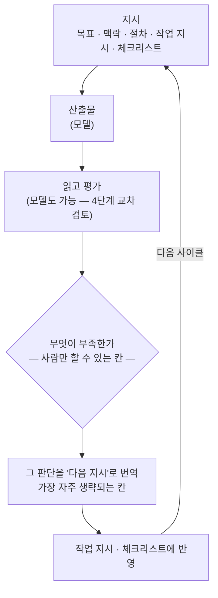

> 📚 시리즈 **「평균을 이기는 법」 3편**입니다. [2편](/blog/beating-the-average/02-six-bad-habits)에서 습관 여섯 개를 보고, 잔소리로는 안 고쳐진다는 것까지 확인했습니다. 이번 편이 처방입니다. 뒤쪽에 **그대로 가져다 쓸 수 있는 한 벌**과 **직접 돌려볼 A/B 프롬프트**를 실었습니다.

## 1. 원칙 — 형용사가 아니라 조건입니다

[1편](/blog/beating-the-average/01-why-my-ai-works-average)에서 도출한 결론을 다시 놓습니다. 우리가 쥔 손잡이는 **조건**뿐입니다. 그러니 모든 교정은 "어떻게 하면 원하는 답의 확률이 그 순간 최고가 되게 만들까"라는 한 질문의 변주입니다.

> **1편의 투표 비유로 말하면, 다섯 층은 선거인단을 좁히는 일입니다.** 조건은 이해관계자만 투표하게 하고, 금지는 후보를 아예 빼고, 관문은 개표 결과를 바로 확정하지 않고, 선택압은 최다득표를 기준으로 다시 심사합니다.
>
> 다만 **유권자 자격을 제한하는 것이지 유권자를 교육하는 것이 아닙니다.** 명부에 없던 안목이 새로 생기지는 않습니다. 그래서 분포 안에 있는 좋은 답은 끌어낼 수 있지만, 애초에 없는 답은 어떤 조건으로도 나오지 않습니다 — 다섯 층의 한계가 여기서 이미 정해집니다(4편에서 회수).

다섯 층과 습관의 대응은 이렇습니다.

| 층 | 하는 일 | 겨냥하는 습관 |
|---|---|---|
| **1. 조건** | 상황을 특정한다 | 1 무난하게 · 2 남들처럼 |
| **2. 국면 분리** | 자동조종을 끌 때를 정한다 | 6 빨리 |
| **3. 앵커** | 기억 대신 기록에 건다 | 5 안전하게 · 6 빨리 |
| **4. 관문** | 체크리스트를 세운다 | 4 비위 맞춰서 · 5 안전하게 |
| **5. 선택압** | 코치를 붙인다 | 전부 (최종 방어선) |

### 층 1 · 상황을 특정합니다 (조건)

**"좋게"를 검증 가능한 것으로 바꿉니다.** 최소한 이 다섯은 있어야 합니다.

- **독자와 용도** — 누가 읽고, 읽고 나서 무슨 결정을 내리는 문서인가
- **성공 기준** — 무엇이 있으면 통과인가 (숫자로 쓸 수 있으면 숫자로)
- **금지 사항** — 무엇이 들어가면 실패인가
- **판단 우선순위** — 속도와 정확성이 충돌하면 어느 쪽인가
- **분량과 형식** — 한 장인가 열 장인가

여기에 하나 더, 이게 진짜입니다. **암묵지 주입.** 1편에서 본 대로 조직의 '좋음'은 학습에 들어갈 수 없습니다. 그러니 매번 줘야 합니다.

- 이 조직이 과거에 **무엇으로 실패했는지**
- 이 사안의 **이해관계자**와 각자가 신경 쓰는 것
- 이미 논의되어 **기각된 안**과 기각 사유
- 우리 쪽에서 통용되는 **용어의 정의**

이 중 마지막 두 개가 특히 셉니다. "이건 이미 검토했다가 이런 이유로 접었다"는 한 줄이, 프롬프트 열 줄보다 분포를 크게 옮깁니다.

### 층 2 · 자동조종을 끌 때를 정합니다 (국면 분리)

**판단하는 일과 실행하는 일을 섞지 않습니다.**

- **판단 국면** — 무엇을 할지, 어느 안을 고를지, 무엇을 포기할지. 여기는 깊게 갑니다. 사람이 개입하고, 결론을 확정한 뒤 넘어갑니다.
- **실행 국면** — 정해진 것을 형태로 만드는 일. 여기는 위임합니다.

핵심은 **난이도 판정을 모델에게 맡기지 않는 것**입니다. 겉보기에 평범한 요청이 사실은 깊은 심의가 필요한 경우가 자주 있는데, 자동 배정은 그 간극을 자주 틀립니다. 오토레인지가 자꾸 틀리면 수동으로 놓는 것과 같습니다. **국면을 아는 사람이 직접 배정합니다.**

그리고 순서가 중요합니다. 판단을 먼저 끝내고 실행으로 넘어가면, 실행 단계에서 습관 5(안전하게)가 판단을 되돌릴 여지가 줄어듭니다.

### 층 3 · 기억 대신 기록에 겁니다 (앵커)

합의된 것을 **밖에 박아둡니다.** 대화 속 합의는 휘발됩니다(습관 6의 감쇠). 문서로 빼두면 매 단계 다시 주입할 수 있습니다.

박아둘 것: 확정된 결정, **그 결정의 근거**, 기각된 대안과 사유, 용어 정의, 지키기로 한 제약.

다만 **앵커는 양날입니다.** 틀린 결론을 박아두면 그것도 똑같이 고착됩니다. 이후 모든 단계가 그 위에 쌓이고, 한참 뒤 모순이 터질 때야 발견됩니다. 그래서 앵커에는 위생 규칙이 붙습니다.

- **근거를 함께** 적습니다 — 근거 없는 결론은 나중에 검증할 수 없습니다
- **언제, 누가 정했는지** 적습니다
- **바꾸는 절차**를 미리 정합니다 (다음 층)

**그리고 이미 오염됐다면, 고치지 말고 다시 시작하는 편이 낫습니다.**

틀린 앵커를 뒤늦게 발견했다고 합시다. 같은 대화에서 "아까 그건 틀렸으니 이렇게 바꾸자"로 수습하고 싶어지는데, 대개 잘 안 됩니다. 1편에서 본 대로 대화는 **앞만 보고 쌓입니다.** 잘못된 전제를 지울 수는 없고 정정이 *덧붙을* 뿐이라, 컨텍스트 안에 서로 모순되는 두 버전이 남습니다. 모델은 그 사이에서 흔들리고, 어느 쪽을 따르는지도 그때그때 달라집니다. 게다가 그 위에 이미 쌓인 결과물들은 옛 전제를 딛고 있습니다.

깨끗한 순서는 이렇습니다.

1. **대화가 아니라 문서를 고칩니다** — 앵커 원본을 바로잡습니다
2. **지금까지의 상태를 적어 둡니다** — 어디까지 확정됐나 / 무엇이 왜 틀렸나 / 다음에 할 일
3. **새 세션에서, 고친 문서로 다시 시작합니다**

2번이 재시작 비용을 흡수합니다. 특히 *무엇이 왜 틀렸나*는 단순한 메모가 아니라 **다음 판 금지 목록의 재료**입니다 — 같은 함정에 두 번 빠지지 않게 하는.

그리고 이게 앵커를 굳이 밖에 두는 또 하나의 이유입니다. **기록이 밖에 있으면 세션을 버리는 게 싸집니다.** 합의가 대화 안에만 있으면 세션을 버릴 때 합의도 함께 날아가니 못 버리고, 못 버리니 오염된 채로 끌고 갑니다. 밖에 있으면 미련 없이 새로 열 수 있습니다.

> 이 블로그를 쓸 때 쓰는 작업 규약에도 같은 줄이 있습니다 — **드리프트가 느껴지면 망설이지 말고 새 세션으로 전환한다. 비용은 상태 기록 문서가 흡수한다.**

### 층 4 · 체크리스트를 세웁니다 (관문)

습관 4와 5를 직접 막는 층입니다. 규칙 세 개면 충분합니다.

**① 뒤집기 선언 규칙.** 이미 합의된 것을 바꾸려면 반드시,

1. "이건 앞서 합의한 것을 뒤집는 변경입니다"라고 **먼저 선언**하고
2. 뒤집는 근거와 **원래의 근거를 나란히** 제시하고
3. 승인 전까지 **문서를 고치지 않습니다**

세 번째가 특히 중요합니다. 승인 전에 문서가 먼저 바뀌면, 그게 다음 단계의 전제가 되어 오염이 하류로 번집니다.

**② 승인 요약 품질 규칙.** "이렇게 할까요?"라고 물을 때는 반드시 **무엇을 포기하는지**를 함께 적게 합니다. 트레이드오프와 깨지는 것이 빠진 요약은 **승인 대상이 아니라고 못 박습니다.** 이 한 줄이 매끄러운 요약으로 승인을 유도하는 경로를 막습니다.

**③ 빈틈 정지 규칙.** 지시에 없는 것을 만나면 임의로 채우지 말고 **멈추고 묻게** 합니다. 기본값으로 메우는 것이 습관이므로, 명시적으로 금지해야 합니다.

### 층 5 · 코치를 붙입니다 (선택압)

앞의 네 층은 좋은 답이 나오도록 미는 것이고, 이 층은 **나쁜 답이 통과하지 못하게 막는 것**입니다. 2편 끝에서 본 대로 정답이 없는 업무일수록 이 층이 유일한 방어선입니다.

- **채점 기준을 산출물보다 먼저 씁니다.** 이게 가장 강력합니다. 결과를 보고 나서 기준을 만들면 이미 나온 결과에 기준을 맞추게 됩니다. 먼저 쓰면 기준이 독립변수가 됩니다.
- **복수 안을 뽑아 기준으로 채점합니다.** 하나만 만들면 비교 대상이 없어 평균인지 아닌지 알 수 없습니다. 서로 다른 전제로 두세 개를 뽑아 놓고 기준에 대면 차이가 드러납니다.
- **적대적 검토를 붙입니다.** "이 안의 가장 큰 약점은?", "이 결론이 틀렸다면 어디서 틀렸을까?", "반대편 입장에서 가장 강한 반박은?" — 조건을 뒤집는 질문들입니다. 습관 4를 정면으로 무력화합니다.
- **다른 맥락에서, 되도록 다른 모델에게 채점시킵니다.** 만든 대화 안에서 채점하면 그 맥락을 그대로 승인합니다. 새 세션이 그다음이고, **다른 모델**이 가장 셉니다 — 분포가 다르면 보는 것도 다르기 때문입니다.
- **끝나고 되돌려 봅니다.** 무엇이 어긋났고 왜 어긋났는지 남깁니다. 이게 다음 사이클의 층 1 재료가 됩니다.

---

## 2. 다섯 층을 한 벌로 조립하면 — 블로그 글쓰기 예제

원칙만 말하고 끝내면 2편에서 비판한 "추상적인 규칙"과 다를 게 없습니다. 그래서 실제로 한 벌을 만들어 놓습니다. 소재는 **이 시리즈를 쓴 작업 자체**입니다. 아래 워크플로우로 이 시리즈를 썼고, 체크리스트도 실제로 돌렸습니다.

### ① 워크플로우 — 단계와 게이트 (층 2)

| 단계 | 국면 | 입력 | 산출물 | 통과 조건 |
|---|---|---|---|---|
| 1. 주제·각도 확정 | **판단** | 문제의식 | 한 문장 명제 + 독자 정의 | 사람 승인 |
| 2. 목차 설계 | **판단** | 명제 | 장·절 구조 | **사람 승인 — 통과 전 본문 금지** |
| 3. 초안 집필 | 실행 | 확정 목차 | 본문 | 초안 체크리스트 |
| 4. **교차 검토** | 실행 | 본문 | 지적 목록 + 개선본 | **다른 모델**의 평가 |
| 5. 사실·링크 검증 | 실행 | 개선본 | 검증된 각주·링크 | 검증 체크리스트 |
| 6. 유입 설계 | 실행 | 본문 | 제목·요약·공유문 | 유입 체크리스트 |
| 7. **전체 교정 읽기** | 실행 | 전체 원고 | 교정된 원고 | 교정 체크리스트 |
| 8. 발행 | 실행 | 전체 | 빌드 통과·게시 | 빌드 성공 |

게이트가 둘(2·7단계), 그리고 외부 눈이 하나(4단계)입니다.

**2단계 게이트 — 목차가 승인되기 전에는 본문을 쓰지 않습니다.** 습관 6(빨리)이 가장 크게 사고 치는 지점이 여기입니다. 목차 없이 쓰기 시작하면 세 번째 문단부터 구조가 표류하고, 그 뒤로는 되돌리는 비용이 새로 쓰는 비용보다 커집니다.

**4단계 — 채점은 다른 모델에게 맡깁니다.** 만든 모델에게 자기 산출물을 채점시키면, 그 모델이 이미 최고 확률이라고 판단한 것을 다시 최고 확률이라고 확인해 줍니다. 1편의 투표 비유로 말하면 **자기 표를 자기가 다시 세는 것**입니다.

다른 모델은 **다른 분포**입니다. 학습 데이터도, 정렬 방식도, 몸에 밴 습관도 다릅니다. 그래서 원저자 모델이 구조적으로 못 보는 것을 봅니다 — 명부가 다른 유권자를 부르는 셈입니다. 새 세션을 여는 것보다 한 단계 강한 조치이고, 층 5(선택압)가 가장 세게 작동하는 지점입니다.

**7단계 게이트 — 발행 전에 처음부터 끝까지 한 번에 읽습니다.** 3~6단계는 전부 *부분* 수정입니다. 한 절을 보강하고, 각주를 갈아 끼우고, 제목을 바꾸면서 도입부를 손봅니다. 각각은 옳은데 **합쳐 놓으면 안 맞는 것들이 생깁니다** — 같은 말을 두 번 하게 되거나, 없어진 구조를 가리키는 표현이 남거나, 바뀌기 전 제목을 전제한 문장이 살아 있거나. **단계를 하나 끼워 넣으면 뒤 단계 번호가 밀리는 것도 그중 하나입니다.**

이건 부분을 다시 읽어서는 안 보입니다. **부분 수정이 만든 불일치는 통독해야만 잡힙니다.** 그래서 별도 단계로 세웁니다.

### ② 작업 명세 — 단계마다 허용과 금지 (층 1)

각 단계에 목적·입력·산출·허용·금지를 붙입니다. 예로 3단계 하나만 완전한 형태로 씁니다.

> **3단계 · 초안 집필**
>
> - **목적**: 확정된 목차의 각 절을 본문으로 채운다
> - **입력**: 확정 목차, 확정 명제 한 문장, 참고자료 목록
> - **산출**: 마크다운 본문
> - **허용**: 절 안에서 문단 구성 자유, 표·예시·비유 추가
> - **금지**
>   - 목차에 없는 절을 추가하기 → 필요하면 **멈추고 물을 것**
>   - 확인되지 않은 수치·인용을 쓰기 → 자리 표시자로 두고 5단계(검증)로 넘길 것
>   - 형용사로 때운 결론("중요하다", "필수적이다", "잘 활용해야 한다")
>   - 앞 절에서 확정한 용어를 다른 말로 바꿔 쓰기
> - **판단 우선순위**: 정확성 > 완결성 > 분량

금지 목록이 허용 목록보다 깁니다. 의도한 것입니다 — **금지가 조건으로서 더 강합니다.** "이건 하지 마라"는 분포를 좁히지만 "자유롭게 하라"는 넓히니까요.

### ③ 산출물 체크리스트 — 통과 못 하면 다음 단계 없음 (층 5)

**목차 체크(2단계)**
- [ ] 한 문장 명제가 목차 전체를 지탱하는가
- [ ] 각 절이 그 명제에 기여하는가 — 기여하지 않으면 삭제
- [ ] 독자가 반박할 지점마다 절이 있는가
- [ ] **주장하는 절과 견해를 말하는 절이 구분되어 있는가**

**초안 체크(3단계)**
- [ ] 각 절이 "그래서 뭐?"에 답하는가
- [ ] 형용사로 끝난 결론이 하나도 없는가
- [ ] 첫 세 문장에서 독자가 **자기 증상을 알아보는가**
- [ ] 소제목만 훑어도 논지가 이어지는가
- [ ] 표나 구체적 예시가 최소 하나 있는가
- [ ] 한계와 반론을 명시했는가

**교차 검토 체크(4단계)** — 원고를 **다른 모델**에게 주고
- [ ] "이 글의 가장 큰 약점은?" — 칭찬을 구하는 질문("어때?")으로 묻지 않았는가
- [ ] 지적을 **받아들일 것과 기각할 것**으로 내가 직접 갈랐는가 (그대로 반영은 판단 위임입니다)
- [ ] 받아들인 지적을 **작업 지시(금지 목록)와 체크리스트에 옮겨 적었는가** — 이번 원고만 고치고 끝내지 않았는가

**검증 체크(5단계)**
- [ ] 모든 각주에 접근 가능한 출처가 있는가
- [ ] 인용한 논문의 제목·연도·저자를 **실제로 확인**했는가
- [ ] 내부 링크가 전부 실재하는 URL과 일치하는가
- [ ] 내부 링크의 **대상 글이 실제로 그 내용을 다루는가** — URL이 살아 있는 것과 내용이 맞는 것은 다릅니다
- [ ] 모든 수치에 출처가 붙어 있는가
- [ ] **확신도 표현이 근거 수준과 맞는가** — 측정한 것, 추론한 것, 견해인 것을 구분했는가

### ④ 유입 설계 체크리스트 (6단계)

아무리 좋은 글도 읽히지 않으면 없는 것과 같으니, 이것도 명시적인 단계로 둡니다.

- [ ] 제목에 **독자가 실제로 검색창에 치는 말**이 들어갔는가 (업계 용어 말고)
- [ ] **제목이 약속한 것을 본문이 갚는가**
- [ ] 첫 세 문장이 배경 설명이 아니라 **증상 묘사**인가
- [ ] 공유될 때 함께 붙일 **한 문장 요약**을 준비했는가
- [ ] 캡처되어 돌 만한 단위(표·체크리스트·비유)가 하나 이상 있는가
- [ ] 독자가 실제로 쓰는 표현이 본문에 자연스럽게 들어가 있는가
- [ ] 다 읽은 사람이 갈 다음 글로 **내부 링크**가 놓였는가
- [ ] 발행 후 어디에 어떤 문구로 올릴지 정해졌는가

> **주의 — 유입 지표도 프록시입니다.** 조회수에 최적화하면, 2편에서 본 습관 3(있어 보이게)을 이번엔 사람이 직접 저지르는 꼴이 됩니다. 낚시 제목은 단기 유입을 얻고 장기 신뢰를 잃습니다.
> 그래서 위 목록에서 **두 번째 항목이 나머지 전부를 이깁니다.** 제목이 약속한 것을 본문이 갚지 못하면, 나머지 일곱 개는 손대지 않습니다.

### ⑤ 교정 체크리스트 (7단계)

발행 직전, **처음부터 끝까지 한 번에** 읽으면서 봅니다.

- [ ] 앞뒤에서 **같은 말을 두 번** 하고 있지 않은가 (부분 수정이 겹치면 생깁니다)
- [ ] **이전 버전의 잔재**가 남아 있지 않은가 — 바뀐 제목을 전제한 문장, 없어진 구조 단위(부·장·절) 표기
- [ ] 앞뒤를 넘나드는 참조가 **실제로 그것을 가리키는가** ("앞에서 본 대로"가 정말 앞에 있는가)
- [ ] 새로 끼워 넣은 문단이 **원래 있던 문단의 소속을 깨지 않았는가** — 바로 뒤 문장이 여전히 앞을 가리키는지
- [ ] 처음 정한 용어를 끝까지 **같은 말로** 부르는가
- [ ] **주어나 목적어가 빠진 문장**이 없는가
- [ ] 문체가 흔들리지 않는가 — 구어체가 튀거나, 1인칭 구간의 경계가 새지 않았는가
- [ ] 소리 내어 읽어 걸리는 문장이 없는가

### ⑥ 앵커와 관문 (층 3·4)

- **문서로 빼둘 것**: 확정 명제 한 문장, 독자 정의, 확정 목차, 용어 정의, **기각한 각도와 그 이유**
- **바꾸는 절차**: 목차 확정 후 구조를 바꾸려면 → ①"이건 확정 목차를 뒤집는 변경입니다" 선언 → ②새 근거와 원래 근거를 나란히 제시 → ③승인 전까지 본문 수정 금지

이 한 벌이 특별해서 듣는 게 아닙니다. **조건이 명시적이라서** 듣습니다.

### 그리고 이건 완성품이 아닙니다

못 박아 둘 것이 하나 있습니다. 위 다섯 칸은 **이 글 하나를 쓰려고 그 상황에 맞춰 정교화한 것**이고, 다음 글에서는 또 달라집니다. 앞에서 ③④⑤를 재사용한다고 했지만, 그건 *고치지 않고 쓴다*가 아니라 *빈 종이에서 시작하지 않는다*는 뜻입니다.

**만능 프롬프트를 찾으려는 시도는 그 자체가 평균을 찾는 일입니다.** 어디에나 맞는 조건은 아무 데도 특정하지 못합니다. 그리고 그건 정확히 2편의 습관 1(무난하게)입니다 — 모델이 저지르던 실수를 이번엔 사람이 저지르는 것이죠. **조건은 좁을수록 세고, 좁으려면 상황마다 달라야 합니다.** 한 벌을 고정하는 순간 그 한 벌이 새로운 평균이 됩니다.

그래서 이 한 벌의 수명은 '완성'이 아니라 **개정**입니다. 이번에 새어 나간 결함이 다음 판 체크리스트의 한 줄이 되고, 지난번에 통했던 금지 항목이 이번엔 불필요해 빠집니다. 그렇게 **고쳐 쓴 이력이 쌓인 것**이 4편에서 말할 자산입니다 — 자산은 문서 한 장이 아니라 그 문서의 개정 내역입니다.

### 루프는 이렇게 돕니다



중요한 것은 **'번역' 칸**입니다. "이 부분이 약하네"에서 멈추면 아무것도 남지 않고, 다음번에 같은 것이 또 나옵니다. **"그래서 작업 지시 칸의 금지 목록에 이 한 줄을 넣는다"**까지 가야 그 실패가 자산이 됩니다. 평가와 지시 사이의 이 번역이 실제로 가장 자주 생략되는 단계입니다.

그리고 이 루프에서 **자동화되지 않는 칸이 정확히 하나** 있습니다 — *무엇이 부족한가를 정하는 자리*입니다.

생성도 모델이 합니다. 교차 검토도 모델이 합니다. 그런데 **다른 모델이 내놓은 지적 중 무엇을 받아들일지는 사람이 정합니다.** 교차 검토도 결국 또 하나의 의견이고, 그 의견을 채택할지 기각할지가 다시 판단이니까요. 앞의 교차 검토가 "스펙이 천장은 만들지 않는다"고 지적했을 때, 그것을 한계로 인정할지 반박할지는 모델이 정해 주지 않습니다.

**사람이 이 칸에서 빠지면 루프가 도는 게 아니라 평균끼리 돌게 됩니다.** 모델이 쓰고, 모델이 채점하고, 모델이 고치고, 아무도 그게 좋아졌는지 모르는 상태로요. 4편에서 "최종 방어선은 사람"이라고 말하는 자리가 정확히 여기입니다.

---

## 3. 그래서 실제로 뭐가 달라지나 — 직접 확인해 보세요

여기까지 읽고도 "그래서 얼마나 달라지는데?"가 남는 게 정상입니다. 그러니 재현할 수 있게 두 프롬프트를 그대로 싣습니다. 같은 모델, 같은 주제, **조건만 다릅니다.** 5분이면 직접 확인할 수 있습니다.

**단, 두 프롬프트는 각각 새 대화에서 돌려야 합니다.** 이유는 아래 주의 상자에 적었습니다.

소재는 **앞에서 만든 그 한 벌**을 그대로 씁니다. B는 새로 지어낸 프롬프트가 아니라, §2의 워크플로우·작업 명세·체크리스트를 다섯 칸에 옮겨 담은 것입니다.

> **다섯 칸이 골격입니다** — ① 목표 ② 맥락 ③ 작업 절차 ④ 작업 지시 ⑤ 체크리스트.
> ①②는 매번 새로 씁니다. ③④⑤는 앞선 작업에서 가져오되, **그대로 쓰는 게 아니라 이번 상황에 맞게 고쳐 씁니다.** 재사용의 뜻은 "빈 종이에서 시작하지 않는다"이지 "손대지 않는다"가 아닙니다.

**A · 그냥 시키기**

```text
'회의를 줄이는 법'으로 블로그 글을 써 주세요.
```

**B · 한 벌을 걸고 시키기** — 첫 줄은 A와 똑같습니다. 아래 다섯 칸이 붙었을 뿐입니다.

```text
'회의를 줄이는 법'으로 블로그 글을 써 주세요. 아래 다섯 칸을 따릅니다.

■ 1. 목표
   - 명제: 회의가 많은 것은 일정 관리의 문제가 아니라,
           '결정을 문서로 남기지 못하는 조직'의 증상이다.
   - 독자: 회의를 줄이라는 지시를 받았지만 무엇부터 손댈지 모르는 팀장.
   - 읽고 내릴 결정: 다음 주에 없앨 회의 하나를 고른다.
   - 분량: A4 2장 이내.
   ※ 위 세 줄은 이미 확정됐다. 바꾸지 말 것. 바꿔야 한다고 판단되면
     먼저 그 이유를 말하고 승인을 받는다.

■ 2. 알아야 할 맥락
   - 작년에 '회의 30분 제한' 규칙을 도입했으나, 회의 수가 늘어
     총 회의시간은 그대로였다 → 그 방향은 이미 기각됨.
   - 우리 조직은 결정 근거를 문서로 남기지 않는다. 그래서 같은 논의가 반복된다.

■ 3. 작업 절차
   1) 목차 설계 → 목차만 제시하고 멈춘다. 내 승인 전에는 본문을 쓰지 않는다.
   2) 초안 집필 → 승인된 목차의 절만 채운다.
   3) 자가 점검 → 5번 체크리스트로 스스로 채점하고, 통과하지 못한 항목을
                  숨기지 말고 함께 보고한다.

■ 4. 작업 지시 (2단계 초안 집필)
   - 허용: 절 안에서 문단 구성 자유, 표·예시·비유 추가
   - 금지:
       · 목차에 없는 절을 추가하기 → 필요하면 멈추고 물을 것
       · "효율적으로", "체계적으로" 같은 형용사로 끝나는 결론
       · 아젠다 명확화·타임박싱·참석자 최소화 같은 어디서나 나오는 일반론
       · 출처 없는 수치
   - 판단 우선순위: 결정 가능성 > 완결성 > 분량

■ 5. 체크리스트 (전부 통과해야 제출)
   □ 각 절이 "그래서 뭐?"에 답하는가
   □ 형용사로 끝난 결론이 하나도 없는가
   □ 첫 세 문장이 배경 설명이 아니라 증상 묘사인가
   □ 한계와 반론을 명시했는가
   □ 독자가 읽고 '없앨 회의 하나'를 고를 수 있는가
```

> 주제('회의를 줄이는 법')는 **여러분이 지금 실제로 써야 하는 글**로 바꿔 넣으세요. 1·2번만 갈아 끼우면 됩니다. 자기 주제로 해야 결과물의 좋고 나쁨이 눈에 들어옵니다.

**결과의 형태 차이**

| | A · 그냥 시키기 | B · 한 벌을 걸었을 때 |
|---|---|---|
| 진행 방식 | 바로 본문을 통째로 뱉음 | **목차부터 내놓고 승인을 기다림** (층 2·4) |
| 구조 | 도입 – 팁 나열 – 마무리 | 명제 – 증상 – 반론 – 고를 것 하나 |
| 내용 | 아젠다 명확화·타임박싱·참석자 최소화 | 이미 기각된 방향임을 알고 배제 |
| 주장 | "회의 문화를 효율적으로 개선하자" | 하나로 특정하고 반대 근거까지 붙임 |
| 결론 | "효율적인 회의 문화를 만들어 갑시다" | 다음 주에 없앨 회의 하나를 고르게 함 |
| 읽고 나서 | "맞는 말인데 뭘 하지?" | 실행할 것이 하나 남음 |
| 누구 글인가 | 아무 회사 블로그 | 우리 팀 이야기 |

A가 특별히 나쁜 게 아닙니다. **조건이 없으면 저게 정답**입니다(습관 1). 누가 읽을지 모르는 글에는 다 넣어두는 게 기댓값이 가장 높으니까요. **요청 문장은 A와 B가 글자 하나까지 같습니다.** 달라진 건 모델도, 요청도 아니고 그 아래 붙은 조건뿐입니다.

특히 두 곳을 눈여겨볼 만합니다.

**첫째, 목차부터 내놓고 멈추는 것.** B는 본문을 바로 쓰지 않습니다. 층 2(국면 분리)와 층 4(관문)가 실제로 작동하는 장면이고, 습관 6(빨리)이 여기서 막힙니다.

**둘째, "이미 기각됨" 한 줄.** B에서 타임박싱류가 사라지는 이유가 그 한 줄입니다. 프롬프트 기교가 아니라 **조직이 가진 실패 기록**이 한 일입니다. 4편에서 말할 자산이 실제로 작동하는 장면이 이겁니다.

### 실제로 돌린 결과물

말로만 하지 않기 위해, 위 두 프롬프트를 실제로 돌린 원문을 그대로 공개합니다. 표를 믿지 마시고 직접 읽어 보세요.

| | 내용 | 링크 |
|---|---|---|
| **A** | 조건 없이 요청한 결과 (Opus 5) | [회의를 줄이는 법](/blog/beating-the-average/meeting-A-no-spec.md) |
| **B** | 다섯 칸을 걸고 요청한 결과 (Opus 5) | [회의는 원인이 아니라 청구서다](/blog/beating-the-average/meeting-B-with-spec.md) |
| **평가** | A·B를 **다른 모델**에게 채점시킨 것 (Fable 5) | [교차 검토 원문](/blog/beating-the-average/meeting-cross-review.md) |
| **v2** | 그 지적을 반영해 다시 쓴 것 (Fable 5) | [개선본](/blog/beating-the-average/meeting-v2-after-review.md) |

A를 먼저 읽어 보시면 무슨 말인지 바로 아실 겁니다. 폴 그레이엄 인용, 출처 없는 수치, "회의는 병이 아니라 열이다" — 틀린 말은 하나도 없는데, **어느 회사 블로그에 올려도 되는 글**입니다.

### 교차 검토가 실제로 잡아낸 것

4단계에서 A·B를 나란히 놓고 다른 모델에게 물었습니다 — *"실제로 개선되었는지 평가해줘."* 돌아온 것 중 셋이 특히 값졌습니다.

**① 조항별 기여도 역추적.** 어느 조항이 어떤 개선을 만들었는지를 표로 갈라 줬습니다. 그중 가장 큰 것이 **맥락 제공**이었는데, 진단이 날카롭습니다 — A의 "출처 없는 수치"는 A가 못 써서가 아니라 **줄 재료가 없는 모델이 근거 공백을 학습 분포의 평균으로 메운 결과**라는 것입니다. 2편 습관 1을 다른 각도에서 확인해 준 셈입니다.

**② 스펙이 사지 못한 것.** B에서 가장 좋은 부분 — 청구서 은유, 3분류 체계 — 은 **스펙 어디에도 없습니다.** 스펙은 제약 공간만 정의했고 그 안에서 무엇을 만들지는 생성 쪽 몫이었습니다. 즉 **다섯 층은 바닥을 올리지 천장을 만들지 않습니다.** 이 시리즈가 하는 주장의 정확한 한계선이고, 원저자 모델은 스스로 이 선을 긋기 어렵습니다.

**③ 체크리스트를 통과하고도 살아남은 결함.** "판정 규칙이 반증 불가능하다"는 지적이 나왔는데, 체크리스트 항목에는 없던 것이었습니다. 체크리스트는 **열거된 것만** 잡습니다. 그래서 이 지적이 다음 체크리스트의 한 줄이 됩니다 — 층 5의 되먹임이 닫히는 지점입니다.

> **정직하게 — 이건 n=1입니다.** 교차 검토 자신이 지적한 한계이기도 합니다. 같은 무제약 프롬프트로 서너 개, 같은 스펙으로 서너 개를 뽑아 분포끼리 비교해야 엄밀합니다. 여기서 보여드리는 것은 "이렇게 차이가 난다"는 증명이 아니라 **"이렇게 확인해 보시라"는 절차**입니다.

> **직접 해보실 때 세 가지만.**
>
> **하나 — 반드시 세션을 나누세요.** 이게 제일 중요합니다. 같은 대화창에서 A를 돌리고 이어서 B를 돌리면 공정한 비교가 아닙니다. 1편에서 본 대로 **맥락이 곧 조건**이라, 앞서 나온 A의 출력이 고스란히 B의 조건에 얹힙니다. 순서를 바꿔도 마찬가지입니다 — B를 먼저 돌리면 그 조건 블록이 대화에 남아 뒤이은 A까지 끌어올립니다. 어느 쪽이든 **"조건만 다르다"는 전제가 깨집니다.** A는 A대로 **새 대화**, B는 B대로 **새 대화**에서 돌려야 합니다.
>
> **둘 — A를 먼저 읽으세요.** 세션을 나눠도 읽는 사람의 머릿속은 안 나뉩니다. B를 먼저 보면 A를 공정하게 못 읽습니다.
>
> **셋 — 둘 다 위의 초안 체크리스트로 채점하세요.** 체감이 아니라 항목 수로 비교됩니다.
>
> (위 표는 조건 차이가 만드는 *형태*의 차이를 정리한 것이고, 출력은 매번 조금씩 달라집니다. 그대로 믿지 말고 직접 돌려 보시는 편이 이 글의 어떤 문장보다 설득력 있을 겁니다.)

---

> **3편 정리** — 교정은 다섯 층입니다. **조건 · 국면 분리 · 앵커 · 관문 · 선택압.** 전부 "조건을 설계한다"는 한 원리의 다른 적용입니다. 그리고 이걸 한 벌로 조립하면 워크플로우·작업 명세·체크리스트가 되고, A/B를 돌려 보면 **모델이 아니라 조건이 결과를 바꾼다**는 것이 눈으로 확인됩니다. 그런데 그 조건의 재료 — 기각된 안, 실패 이력, 채점 기준 — 는 어디서 오는 걸까요. 다음 편의 주제입니다.

---

#### 📚 시리즈 내비게이션

- **함께 읽기:** [LLM에게 기능 목록 대신 유스케이스를](/blog/ai-era-engineering/01-usecases-not-feature-lists) — 층 1(조건)의 실전판
- **이전 편:** [2편 · 몸에 밴 여섯 가지 습관](/blog/beating-the-average/02-six-bad-habits)
- **3편 (지금):** 교정 다섯 층 ← 현재 글
- **다음 편:** [4편 · 조건이 자산이다](/blog/beating-the-average/04-conditions-as-asset)
