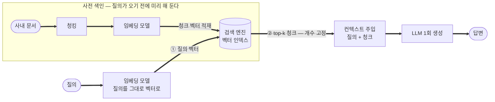
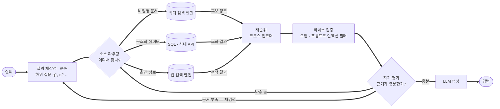

> 📚 시리즈 **「LLM의 발전 과정과 에이전트」 5편**입니다.
> 전체 그림은 원본 글 **[LLM의 발전 과정과 에이전트](/blog/llm-agents)**, 앞 편은 **[4편 · 작은 모델 + 루프가 큰 모델을 이긴다](/blog/llm-agents-series/04-small-model-big-loop)**.

RAG(Retrieval-Augmented Generation)는 모델을 재학습하지 않고 **외부 지식을 검색해 프롬프트에 넣어** 답하게 하는 기법입니다. 에이전트의 도구 사용 중 검색·DB 조회가 바로 이것인데, 전통 RAG와 에이전트가 결합한 RAG는 **결정적으로 다릅니다.**

---

## 1. 전통(Naive) RAG의 위치

RAG(**R**etrieval-**A**ugmented **G**eneration, 검색 증강 생성)는 모델을 다시 학습시키지 않고 **필요한 지식을 그때그때 찾아 프롬프트에 넣어** 답하게 하는 기법입니다. 이름 그대로 셋으로 나뉩니다 — **검색**(관련 문서 조각을 외부 저장소에서 찾아온다) → **증강**(찾아온 것을 프롬프트에 붙여 입력을 보강한다) → **생성**(모델이 그 근거를 보고 답한다).

푸는 문제는 1세대 LLM의 약점과 정확히 겹칩니다: **지식 컷오프, 환각(근거 부재), 내부 데이터 미활용.** 모델의 *기억*에 의존하던 것을 *자료*에 의존하게 바꾸는 것이고, **모델은 그대로 두고 입력만 바꾸므로** 재학습·파인튜닝보다 훨씬 싸고 빠릅니다. 그래서 에이전트 이전부터 널리 쓰였습니다.

**전통 RAG 파이프라인 (단방향·고정)**

- 검색 엔진과의 **주고받음이 딱 한 번**(①②)인 직선형 파이프라인. "도구 사용의 한 특수 사례"지만 **루프가 없는 고정 절차**라는 점이 결정적 한계.
- 그림에 **되돌아가는 화살표가 하나도 없습니다** — [3편](/blog/llm-agents-series/03-anatomy-of-an-agent)에서 에이전트를 가른 바로 그 화살표입니다.
- 왼쪽 **색인 구역은 질의와 무관하게 미리 도는 별도 공정**입니다. 그래서 검색 품질의 상당 부분이 **질의가 오기 전에 이미 결정**돼 있습니다 — 청킹을 잘못 끊어 두면 무슨 질의를 해도 그 근거는 나오지 않습니다.

**전통 RAG의 한계**

- 검색이 **단 한 번** → 첫 검색이 부실하면 그대로 실패.
- 사용자 질의를 **그대로 임베딩** → 모호하거나 여러 단계 질문에 약함.
- 검색 결과 품질을 **스스로 평가·재시도하지 못함.**
- **다중 홉(multi-hop) 추론 불가**: "A를 찾아 그걸 근거로 B를 찾는" 연쇄가 안 됨.
- top-k 고정 → **관련 없는 청크가 섞이거나** 필요한 근거가 누락.
- 검색된 외부 텍스트를 **그대로 신뢰** → 오염·프롬프트 인젝션에 취약.

---

## 2. 에이전트와 결합한 RAG (Agentic RAG)

핵심 변화는 **검색이 "고정 파이프라인의 한 단계"에서 "루프 안의 도구 호출"로 바뀐 것**입니다. 모델이 *필요할 때, 필요한 만큼, 질의를 바꿔가며* 반복 검색합니다.

되돌아가는 화살표가 둘 생겼습니다 — **재검색**(질의를 바꿔 다시)과 **다중 홉**(이번 결과가 다음 질의의 단서). 검색 엔진과의 상호작용이 **한 번의 주고받음에서 대화로** 바뀐 것이 차이의 전부입니다.

- **질의 재작성·분해**: 모호한 질문을 하위 질문으로 쪼개 각각 검색.
- **자기 평가(self-reflection)와 재검색**: 결과가 부족하면 스스로 판단해 다시 검색.
- **다중 홉**: 1차 결과를 근거로 2차 질의를 생성하는 연쇄 검색.
- **소스 라우팅**: 벡터DB·SQL·웹·API 중 무엇을 쓸지 결정.
- **재순위(reranking)**: 1차 결과를 **크로스 인코더**로 정밀 재정렬해 상위 근거 정확도를 높임.
- **정교한 청킹**: Parent-Child 청킹 등으로 "검색은 작은 단위, 제공은 넓은 문맥"을 동시 달성.
- **하네스 검증**: 검색된 외부 데이터의 오염·인젝션을 모델 바깥에서 필터링.

**성능 차이**

- 다단계·모호 질의에서 **정확도↑**, 근거 충실도↑, **환각↓**.
- 대가는 에이전트 일반과 동일: **반복 검색·생성으로 지연↑, 비용↑, 복잡도↑.**
- 그래서 실무에선 **"결정론 우선"**으로 분기한다 — 단순 질의는 전통 RAG 경로로 싸고 빠르게, **복잡한 질의만 에이전트 루프로** 보내 비용·지연을 최적화.

---

## 3. 한눈에 비교

| 구분 | 전통(Naive) RAG | 에이전트 RAG |
|---|---|---|
| 검색 횟수 | 1회 고정 | 필요한 만큼 반복 |
| 질의 처리 | 원문 그대로 임베딩 | 재작성·분해 |
| 결과 검증 | 없음 | 자기 평가 후 재검색 |
| 다중 홉 | 불가 | 가능 |
| 소스 선택 | 단일(보통 벡터DB) | 라우팅(벡터·SQL·웹·API) |
| 오염 방어 | 그대로 신뢰 | 하네스로 필터링 |
| 지연·비용 | 낮음 | 높음 |
| 적합 상황 | 단순 사실 질의 | 복잡·다단계·고정확 질의 |

> 요지: 전통 RAG는 **싸고 빠른 직선**, 에이전트 RAG는 **느리지만 똑똑한 루프**. 둘 중 하나가 아니라, 질의 난이도에 따라 **갈라 보내는 설계**가 정답입니다.

---

#### 📚 시리즈 내비게이션

- **원본(전체):** [LLM의 발전 과정과 에이전트](/blog/llm-agents)
- **이전 편:** [4편 · 작은 모델 + 루프가 큰 모델을 이긴다](/blog/llm-agents-series/04-small-model-big-loop)
- **5편 (지금):** RAG — 전통 vs 에이전트 ← 현재 글
- **다음 편:** [6편 · 에이전트 회사의 해자 — 공개 vs 비밀](/blog/llm-agents-series/06-agent-company-moat)
