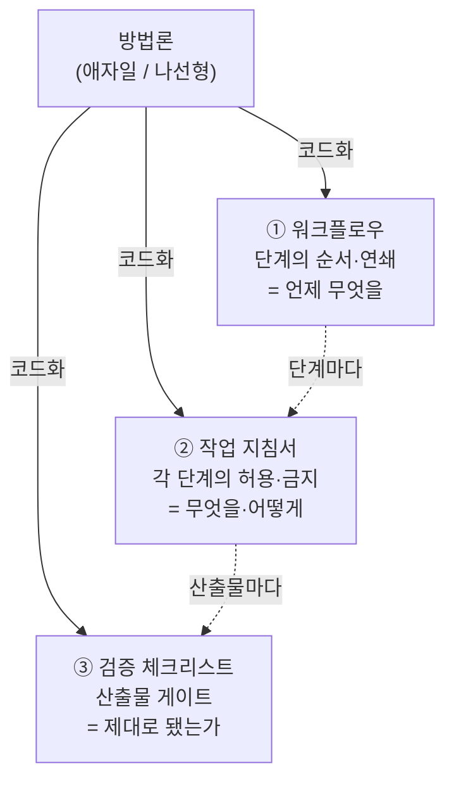

> 📚 시리즈 **「모델에게 SW 엔지니어링 가르치기」 2편**입니다. [1편](/blog/teaching-swe-to-models/01-why-teach-engineering)에서 *평균을 이기려면 구조적 규율이 필요하다*고 했습니다. 이번엔 그 규율을 **모델에게 어떻게 먹일지**의 큰그림입니다.

편향을 교정하겠다고 마음먹으면, 처음 떠오르는 방법은 하나입니다 — **좋은 지침을 잔뜩 써서 한 프롬프트에 다 넣는다.** "SOLID 지켜라, 유스케이스부터 써라, 예외를 다뤄라, 테스트를 짜라, 문서를 남겨라…" 시스템 프롬프트가 A4 다섯 장이 됩니다. 그런데 이게 **역효과**입니다.

## 1. 문제 — '전부 한꺼번에'는 다시 평균으로 회귀한다

방법론 전체를 한 컨텍스트에 통째로 던지면 네 가지가 동시에 터집니다.

- **토큰 폭증**: 지침이 길수록 정작 *작업*에 쓸 컨텍스트가 줄고, 길어진 문맥은 모델을 무겁고 둔하게 만듭니다([이론편 2편](/blog/llm-agents-series/02-why-llm-gets-heavy)).
- **집중 분산**: 지금 단계와 무관한 지침(테스트 규칙을 요구사항 단계에서)이 노이즈로 섞여, 정작 이 단계에서 지켜야 할 규율의 밀도가 낮아집니다.
- **지침끼리 충돌**: "빠르게 프로토타이핑" vs "완결적으로 설계"처럼 단계마다 반대인 지시가 한자리에 있으면, 모델은 *평균을 택합니다* — 어중간하게.
- **역설적 평균회귀**: 장문의 일반론적 지침은 그 자체가 *"좋은 개발 원칙의 평균"* 이라, 모델을 다시 무난한 중앙으로 돌려보냅니다.

> 즉 **긴 일반 지침은 편향의 해독제가 아니라, 편향의 또 다른 형태입니다.** 평균을 이기려다 평균을 부릅니다.

## 2. 해결 — 방법론을 3층으로 코드화한다

방법론을 하나의 덩어리가 아니라, **역할이 다른 세 층**으로 분해합니다. 각 층은 서로 다른 질문에 답합니다.

- **① 워크플로우**(3편): 단계의 *순서와 연쇄*. 개념/요구 → 아키텍처 → 유스케이스 → 객체모델 → 시뮬레이션 → … → 구현. *언제 무엇을* 하는지의 뼈대.
- **② 작업 지침서**(4편): *각 단계 안에서* 무엇을 도출하고 무엇을 금지하는지. 평균 경로("바로 CRUD 나열")를 명시적으로 봉쇄하는 허용/금지 목록.
- **③ 검증 체크리스트**(5편): 그 단계의 *산출물*이 지침을 지켰는지 통과/반려하는 게이트.

세 층은 독립이 아니라 **맞물립니다.** 워크플로우가 "지금은 유스케이스 단계"라고 정하면, 그 단계의 지침서가 열리고, 그 산출물이 그 단계의 체크리스트로 검증됩니다.

## 3. 핵심 원칙 — 단계별로 '그 단계 조각만' 준다

여기가 이 시리즈의 심장입니다. 세 층을 코드화하는 이유의 절반은 **잘게 쪼개서 필요할 때만 꺼내 쓰기 위해서**입니다.

모델에게 방법론 전체를 주지 않습니다. **지금 이 단계에 해당하는 워크플로우 위치 + 그 단계의 지침 + 그 단계의 체크리스트, 딱 그 조각만** 컨텍스트에 올립니다. 유스케이스를 쓸 땐 유스케이스 지침만, 객체모델을 짤 땐 객체모델 지침만.

| 방식 | 컨텍스트 | 집중 | 편향 |
|---|---|---|---|
| 방법론 통째로 주입 | 폭증 | 분산 | 다시 평균회귀 |
| **단계 조각만 주입** | **가벼움** | **한 점에 집중** | **좁은 규율이 평균을 누름** |

이건 [실전편 2편(컨텍스트 다이어트)](/blog/ai-coding-series/02-tokens-context-keep-light)과 [3편(분할정복)](/blog/ai-coding-series/03-divide-and-conquer)의 원리를 *지침 자체에* 적용한 것입니다. 작업을 쪼개듯, **규율도 쪼갭니다.**

> 왜 조각내면 편향이 덜 새는가 — **좁은 문맥 + 구체적 지침**이면 모델이 평균으로 흩어질 여지가 줄기 때문입니다. "좋은 소프트웨어를 만들어라"(넓고 추상적)는 평균을 부르지만, "이 유스케이스의 콜레보레이션 데이터에서만 필드를 뽑고, 없는 필드는 추가 금지"(좁고 구체적)는 평균이 끼어들 틈이 없습니다.

## 4. 그래서 필요한 것 — 라우팅(오케스트레이션)

단계별로 조각을 갈아 끼우려면, *"지금 어느 단계이고, 어느 조각을 올릴지"*를 정하는 **라우팅**이 필요합니다. 이건 사람이 손으로 할 수도 있고([실전편 6편의 자동화 경계](/blog/ai-coding-series/06-workflow-as-agent-prompts)), 에이전트가 워크플로우를 따라 자동으로 다음 조각을 로드하게 만들 수도 있습니다. 어느 쪽이든 골격은 같습니다 — **워크플로우가 인덱스, 지침서·체크리스트가 페이지.** 필요한 페이지만 펼칩니다.

> 이 구조 자체가 [에이전트 루프](/blog/llm-agents-series/03-anatomy-of-an-agent)를 프로젝트 규모로 펼친 것입니다 — 단계마다 *계획(어느 조각)→실행(그 단계 작업)→검증(체크리스트)→다음*. 그래서 뒤에 나올 검증 게이트가 곧 루프의 '검증' 스텝입니다.

---

> 정리: 편향 교정의 큰그림은 *"좋은 지침을 다 때려넣기"*가 **아닙니다.** 방법론을 (워크플로우 + 작업 지침서 + 검증 체크리스트) **3층으로 코드화**하고, 단계마다 **그 조각만** 모델에게 주는 것 — 컨텍스트를 좁혀 집중을 높이고, 좁은 규율로 평균을 누릅니다. 다음 세 편이 각각 이 세 층입니다.

---

#### 📚 시리즈 내비게이션

- **연결 이론:** [왜 LLM은 길어지면 무거워지나](/blog/llm-agents-series/02-why-llm-gets-heavy) · [에이전트 해부](/blog/llm-agents-series/03-anatomy-of-an-agent)
- **이전 편:** [1편 · 왜 SW 엔지니어링을 가르쳐야 하는가](/blog/teaching-swe-to-models/01-why-teach-engineering)
- **2편 (지금):** 큰그림 — 어떻게 가르칠 것인가 ← 현재 글
- **다음 편:** [3편 · 워크플로우 — 애자일 vs 나선형](/blog/teaching-swe-to-models/03-workflow)
