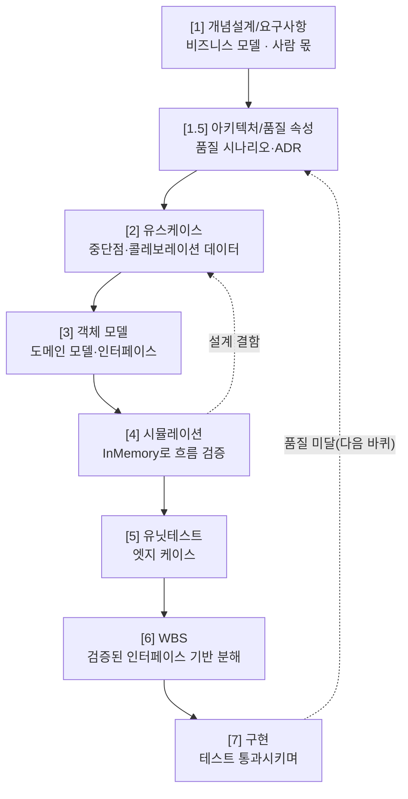

> 📚 시리즈 **「모델에게 SW 엔지니어링 가르치기」 3편**입니다. [2편](/blog/teaching-swe-to-models/02-how-to-teach-big-picture)에서 방법론을 *3층으로 코드화*한다고 했습니다. 그 첫 층 — **워크플로우**입니다. *언제 무엇을* 할지의 뼈대죠.

모델의 기본 충동은 "**바로 코딩**"입니다. 무엇을 시키든 곧장 코드부터 뱉습니다 — 학습 데이터에서 가장 흔한 경로가 그거니까요([1편의 평균회귀](/blog/teaching-swe-to-models/01-why-teach-engineering)). 워크플로우의 첫 번째 임무는 그 충동을 **막고, 순서를 강제**하는 것입니다. 그런데 아무 순서나가 아니라, *품질을 담보하는* 순서여야 합니다. 무엇을 따르게 할까요?

## 1. 두 후보 — 애자일과 나선형

| 방법론 | 뼈대 | 강점 | 모델에게 가르칠 때 |
|---|---|---|---|
| **애자일**[^agile] | 짧은 반복·증분·피드백 | 요구 변화에 유연, 빠른 산출물 | *리듬*은 좋지만, "무엇을 검증할지"의 **골격이 약함** → 모델이 반복 안에서도 평균회귀 |
| **나선형**[^spiral] | 위험(risk) 주도, 반복마다 위험을 먼저 태움 | **품질 속성**(성능·확장성·복구성)을 단계적으로 조인다 | 각 바퀴의 *산출물과 검증*이 뚜렷 → 코드화에 유리 |

애자일의 *반복·증분*은 매력적입니다. 하지만 애자일만으로는 "반복하라"까지만 말해 줄 뿐, **각 반복에서 무엇을 산출하고 무엇을 검증할지**를 못 박지 않습니다. 그 빈틈으로 평균회귀가 새어 들어옵니다 — 모델은 "빠른 반복"을 "*대충 빨리*"로 해석하기 쉽거든요.

## 2. 선택 — 나선형 뼈대 + 애자일 리듬

그래서 이 시리즈는 **나선형을 뼈대**로 삼고, **애자일의 짧은 리듬**을 얹습니다.

- **나선형**: 품질 속성은 첫 바퀴에 다 알 수 없습니다. **V1으로 기능을 검증**(PoC)하고, 운영·벤치마크로 품질 미달을 발견한 뒤, **V2에서 아키텍처를 재설계**합니다. 이때 유스케이스·도메인 모델은 재사용됩니다([실전편 5편](/blog/ai-coding-series/05-verify-design-before-code)).
- **애자일 리듬**: 각 바퀴 안은 짧은 단계로 잘게 돌립니다 — 산출물 하나를 만들고, 바로 검증하고, 다음으로. 큰 폭포수 한 방이 아니라, *작은 단계의 연쇄*.

> 왜 이 조합이 편향을 이기나 — **나선형이 "품질 속성"이라는, 평균으로는 절대 안 나오는 축을 강제**하기 때문입니다. 평균적 코드는 "일단 돌아가는" 기능(V1)에서 멈춥니다. 나선형은 거기서 멈추지 못하게 하고, *돌려 보고 품질을 재측정*하는 두 번째 바퀴를 의무화합니다.

## 3. 워크플로우를 단계 파이프라인으로 코드화

나선형 한 바퀴를, 모델이 따라갈 수 있는 **단계의 연쇄**로 박제합니다. 핵심 규칙 하나 — **각 단계의 산출물이 다음 단계의 입력이자 정당성**이 됩니다. **코드는 맨 마지막.**



이 그래프가 **워크플로우 층의 전부**입니다 — *언제 무엇을* 하는지의 지도. 각 노드 *안에서 무엇을·어떻게* 하는지는 [4편(작업 지침서)](/blog/teaching-swe-to-models/04-work-instructions)가, 각 노드의 *산출물이 맞는지*는 [5편(검증)](/blog/teaching-swe-to-models/05-verification)이 맡습니다.

> 이 파이프라인 자체는 [실전편 5편](/blog/ai-coding-series/05-verify-design-before-code)에서 이미 소개했습니다. 이 시리즈가 더하는 건 관점입니다 — **이건 개발 절차이기 이전에, 모델의 평균 충동('바로 코드')을 막는 방벽**이라는 것. 단계가 강제되는 순간, 모델은 코드로 직행하지 못하고 상류 산출물을 먼저 통과해야 합니다.

## 4. 이걸 '바로 쓰는 프롬프트'로 — 워크플로우 코드화 예제

말로 "나선형을 따르라"고 해선 안 지켜집니다([1편](/blog/teaching-swe-to-models/01-why-teach-engineering)). 위 절차를 **모델이 그대로 따르는 프롬프트로 박제**한 예제입니다 — 실제 프로젝트(300페이지 PDF 번역 시스템)에서 검증된 워크플로우의 핵심만 추렸습니다.

```text
# 워크플로우: 분석설계 → 검증 → 구현 (나선형)
# 코드는 맨 마지막. "바로 코드"로 직행하지 않는다.

## 불변 규칙
1. 각 단계 산출물이 다음 단계의 입력·정당성. "왜?"는 한 단계 위를 가리킨다.
2. 한 번에 한 단계. [완료 기준]을 통과해야 다음으로 간다(게이트).
3. 1단계(개념·요구)는 사람이 준다. 너는 1.5부터 생성하고 단계마다 검증받는다.
4. 지시한 것만 말고 '빠진 것'(선행조건·예외·중단점)을 스스로 표시하라.
5. 품질 속성 미달이면 → 아키텍처만 교체, 유스케이스·모델은 재사용(나선형 다음 바퀴).

## 단계
[1]   개념/요구 (사람)   → 시스템 경계·액터·제약
[1.5] 아키텍처/품질속성   → 품질 시나리오("자극→환경→응답→측정")·ADR
[2]   유스케이스        → 중단점·필수정보·예외흐름   | 완료: 기능나열(CRUD) 아님, 예외흐름 있음
[3]   객체 모델         → 도메인 모델·인터페이스      | ⚠ 바텀업: 구체 구현 먼저 → 인터페이스 역추출 (4편)
[4]   시뮬레이션        → InMemory로 유스케이스 흐름 재현(외부 mock)
[5]   유닛테스트        → 엣지 케이스
[6]   WBS              → 검증된 인터페이스 기준 작업 분해
[7]   구현             → TDD + 통합 테스트

## 실행 지시 (매 호출)
- 현재 단계: {STAGE}   / 입력: {직전 산출물}
- 이 단계 산출물만 생성. 다음으로 넘어가지 마라(게이트는 사람이 연다).
- 끝에 [완료 기준] 자가점검(항목별 O/X + 빠진 것)을 붙여라.
```

> 이 프롬프트가 편향을 막는 방식은 앞서 말한 그대로입니다 — **게이트(규칙 2)로 직행을 막고, 나선형(규칙 5)으로 품질 축을 강제**합니다. 그리고 3단계의 `⚠ 바텀업`이 이 시리즈의 한 수입니다 — *사람에겐 탑다운이 맞지만 모델 실측에선 바텀업이 나았다*([4편](/blog/teaching-swe-to-models/04-work-instructions)). 사람 절차를 베끼지 않고 **모델 거동에 맞춰 교정**한 것이죠. 각 단계 `[완료 기준]`은 [5편](/blog/teaching-swe-to-models/05-verification)에서 체크리스트로 확장됩니다.

## 5. 이 뼈대가 편향을 막는 두 지점

- **직행 차단**: "바로 코딩"이라는 최빈 경로를 물리적으로 봉쇄합니다. 코드는 7단계이고, 그 앞에 6개의 관문이 있습니다.
- **품질 축 강제**: 나선형의 두 번째 바퀴가 *품질 속성*을 의무화해, "돌아가면 끝"이라는 평균에서 벗어나게 합니다.

단, 단계를 강제하는 것만으로는 부족합니다 — 모델은 *각 단계마저 평균적으로* 처리하려 드니까요(유스케이스를 시키면 CRUD를 나열하듯). 그래서 단계 **안**을 규율하는 지침서가 필요합니다. 다음 편입니다.

> 참고 — *개념설계·요구사항*(1단계)만은 사람 몫입니다. "무엇을·왜"는 도메인 판단이라 위임 불가고, 여기가 정확해야 하류가 기계적으로 도출됩니다([실전편 6편의 자동화 경계](/blog/ai-coding-series/06-workflow-as-agent-prompts)).

---

> 정리: 워크플로우 층은 *언제 무엇을* 의 뼈대입니다. **나선형**(품질 속성을 강제하는 두 바퀴)을 골격으로, **애자일의 짧은 리듬**(단계마다 산출·검증)을 얹어, 나선형 한 바퀴를 *산출물이 연쇄되는 단계 파이프라인*으로 코드화합니다. 이 뼈대가 모델의 "바로 코드" 충동을 막습니다. 이제 각 단계 **안**을 규율할 차례입니다.

---

## 미주 (참고 자료 및 링크)

[^agile]: **[1차 선언문]** Kent Beck 외, 「Manifesto for Agile Software Development」, 2001. — "포괄적 문서보다 작동하는 소프트웨어를" 등 네 가지 가치. *문서를 버리라*가 아니라 문서**보다** 작동을 우선하라는 선언. <https://agilemanifesto.org/>

[^spiral]: **[1차 문헌]** Barry W. Boehm, 「A Spiral Model of Software Development and Enhancement」, *IEEE Computer* 21(5), 1988, pp. 61–72. — 위험(risk) 주도로 반복마다 위험을 먼저 해소하고, 각 바퀴가 산출물·검증을 갖는 나선형 개발 모델. doi:10.1109/2.59

---

#### 📚 시리즈 내비게이션

- **연결 이론/실전:** [실전편 5편 · 코드 쓰기 전에 설계를 검증하라](/blog/ai-coding-series/05-verify-design-before-code)
- **이전 편:** [2편 · 큰그림 — 어떻게 가르칠 것인가](/blog/teaching-swe-to-models/02-how-to-teach-big-picture)
- **3편 (지금):** 워크플로우 — 애자일 vs 나선형 ← 현재 글
- **다음 편:** [4편 · 작업 지침서](/blog/teaching-swe-to-models/04-work-instructions)
